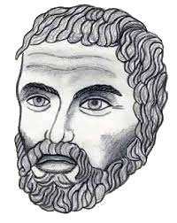

# 아폴로니우스

아폴로니오스(고대 그리스어: Ἀπολλώνιος, 기원전 262년~기원전 190년, Apollonius of Perga)는 고대 그리스의 수학자 또는 기하학자이다. 그리고 원뿔 단면에 대한 연구로 유명한 천문학자이기도 하다. 소아시아의 페르게에서 출생하였으며 이집트 알렉산드리아에서 유클리드와 함께 수학하였고 그곳에서 사망하였다. 에우클레이데스·아르키메데스와 함께 그리스의 3대 수학자로 불리운다. 그의 업적으로 원뿔 곡선의 성질과 그 단면에 대한 연구로 가장 잘 알려져있다. 타원, 쌍곡선, 포물선 등의 용어의 정의를 처음 사용하기도 하였다. 많은 책을 저술하였으나 지금까지 전해내려오는 것은 &laquo; 원뿔 곡선론 &raquo; 뿐이다. 또한 고대 그리스 시대에 그가 쓴 논문들은 대부분 유실되었다. 제목과 내용에 대한 요약은 후대에 알렉산드리아 파푸스에 의해 전해지고 있다. 여덟 권의 책 중에서 I권, II권, III권, IV권 만이 그리스어 원본이 남아있고, V권, VI권, VII권은 Banū Mūsā 가 의뢰한 Thābit ibn Qurra의 아랍어 번역본이 있고 그리스 원본은 손실되었다. 그리고 VIII권의 상태는 알 수 없으나 첫 번째 초안이 존재했었고 최종 초안이 제작되었는지 여부는 알려져 있지 않다. 단, Edmond Halley에 의한 "재구성"된 판이 라틴어로 존재한다.

17세기의 수학자들은 모두 아폴로니우스를 읽었습니다. 이 시기의 독창적인 수학 작품은 아폴로니우스의 작품에 대한 주석으로 쓰이거나 아폴로니우스의 잃어버린 것으로 추정되는 작품의 재구성으로 쓰인 경우가 많았다. 곡선 연구에 있어서는 아폴로니우스의 연구, 특히 『원뿔론』을 확장하고 일반화하려는 시도를 하는 경우가 많았다. 10세기와 11세기에 <원뿔론>에 아랍어로 추가된 중요한 내용도 과학 혁명의 수학에 결정적인 영향을 미쳤다.

&laquo; 원뿔 곡선론 &raquo;은 정의, 그림, 증명 등이 유클리드 &laquo; 원론 &raquo;의 논리적 구성 순서((가정, 정리, 증명, 대상에 대한 언어적 설명))를 따르고 있다. 기하학은 움직이는 물체가 아닌 고정된 물체로 이루어져 있다. 대수 표기법도, 좌표도 없었고, 실제로 수치도 없었다. I권 ~ VII권 내에는 387개의 명제가 있다. 현대 기하학의 교과서의 명제의 배열도 이 책의 순서를 따르고 있다.

원뿔은 평면에서 원뿔 곡선을 축에서 평행하고 정렬된 선분의 집합으로 보는 원뿔 단면에 대한 체계적인 접근 방식이다. 이 접근 방식은 좌표 기하학의 개념과 매우 유사하다. 이러한 이유로 원뿔에서 개발된 특정 개념은 함수 개념을 개발하는 데 기본이 되었다. 원뿔에는 오늘날 거의 알려지지 않은 다양하고 아름다운 정리가 포함되어 있다. 특히 대칭, 축, 공액 지름(켤레 지름)에 대한 정리는 고등학교 수준에서 공부할 수 있으며, 사용된 주요 수학적 결과는 유사성과 기하학적 수단이다. 이러한 정리는 17세기 내내 광범위하게 사용되었는데, 예를 들어 뉴턴의 프린키피아(1952)에서 행성 궤도에 대한 논의를 위해 사용되었다.

