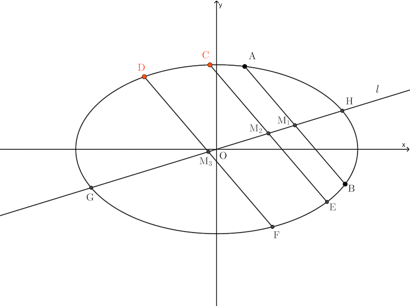

# I권

## 정의 4

한 평면에 있는 곡선의 경우, 이 곡선(포물선, 타원)에 어떤 직선(현, chord)에 평행한 모든 직선을 곡선에서 그려진 어떤 직선에 의해서 이등분하는 직선을 **_지름(diameter)_** 이라 부른다. 그리고 곡선과 지름의 교점을 **_곡선의 꼭짓점(vertex of curve)_** 이라 부르고, 이러한 평행선들을 지름에 그려진 **_세로좌표(ordinate)_** 라 부른다.

### 예제 1

아래 타원에서 주어진 현 $\rm AB$ 에 대하여, 이 현과 평행한 현 $\rm CE$, 현 $\rm DF$ 를 그리자. 그리고 현 $\rm AB$, 현 $\rm CE$, 현 $\rm DF$ 의 중점을 각각 $\rm M_1$, $\rm M_2$, $\rm M_3$ 이라 하자. 그러면 이 세 중점을 지나는 직선 $l$ 을 타원의 지름이라고 한다. 그리고 지름 $l$ 과 타원과의 교점 $\rm G$, $\rm H$ 를 곡선의 꼭짓점이라 한다. 직선 $\rm AB$, $\rm CE$, $\rm DF$ 를 세로좌표라 한다.

### 예제 2

포물선에서 주어진 현 $\rm AB$ 에 대하여, 이 현과 평행한 현 $\rm CE$, 현 $\rm DF$ 를 그리자. 그리고 현 $\rm AB$, 현 $\rm CE$, 현 $\rm DF$ 의 중점을 각각 $\rm M_1$, $\rm M_2$, $\rm M_3$ 이라 하자. 그러면 이 세 중점을 지나는 직선 $l$ 을 포물선의 지름이라고 한다. 그리고 지름 $l$ 과 포물선과의 교점 $\rm G$ 를 곡선의 꼭짓점이라 한다. 직선 $\rm AB$, $\rm CE$, $\rm DF$ 를 세로좌표라 한다.

포물선에서 현 $\rm AB$ 의 위치에 따라 지름의 위치가 바뀐다.

---

## 정의 5

마찬가지로, 한 평면에 놓인 두 개의 곡선(쌍곡선)에 대하여 두 곡선을 자르고 어떤 직선(현)에 평행한 곡선 중 하나에 그려진 모든 직선을 이등분하는 직선을 **_가로 지름(transverse diameter)_** 이라 부른다. 그리고 곡선과 가로 지름의 교점을 **_곡선의 꼭지점_** 이라 부른다. 그리고 두 곡선 사이에 있는 직선과 곡선 사이에 끼어 있고 어떤 직선과 평행하게 그려진 모든 직선을 이등분한 직선을 **_세로 지름(upright diameter)_** 이라 부른다. 그리고 평행선을 가로 또는 세로 지름에 그려진 **_좌표(ordinate)_** 라 부른다.

### 예제 3

아래 포물선에서 주어진 현 $\rm AB$ 에 대하여, 이 현과 평행한 현 $\rm CE$, 현 $\rm DF$ 를 그리자. 그리고 현 $\rm AB$, 현 $\rm CE$, 현 $\rm DF$ 의 중점을 각각 $\rm M_1$, $\rm M_2$, $\rm M_3$ 이라 하자. 그러면 이 세 중점을 지나는 직선 $l$ 을 쌍곡선의 지름이라고 한다. 그리고 지름 $l$ 과 쌍곡선과의 교점 $\rm G$ 를 곡선의 꼭짓점이라 한다. 직선 $\rm AB$, $\rm CE$, $\rm DF$ 를 세로좌표라 한다.

---

## 정의 6

곡선 또는 두 개의 곡선에서 직선(현)에 평행한 모든 직선을 이등분하는 두 개의 지름이 각각 서로 다른 직선에 평행선 직선(현)이면 이 두 지름을 **_공액 지름(conjugate diameter)_** 이라 부른다.

### 예제 4

지름 $\rm AB$ 의 공액 지름은 지름 $\rm CD$ 이다. 두 지름은 서로 다른 주어진 현에 평행한 현이 될때 두 지름 중 다른 한 지름을 공액지름이라 한다.

---

## 정의 7

그리고 곡선 또는 두 곡선 중 한 개의 곡선에서 직선(현)에 평행한 직선을 직각으로 자른 직선 또는 지름을 곡선 또는 두 개의 곡선의 **_축_** 이라 한다.

### 예제 5

지름 $\rm AB$ 는 주어진 현에 수직이다. 다라서 지름 $\rm AB$ 를 축이라 한다.

---

## 정의 8

그리고 곡선 또는 두 곡선 중 한 개의 곡선에서 직선(현)에 평행한 직선을 직각으로 자른 지름의 공액 지름을 곡선과 두 곡선의 **_공액 축(conjugate axies)_** 이라 한다.

### 예제 6

지름 $\rm AB$ 는 축이고 지름 $\rm CD$는 지름 $\rm AB$의 공액 지름이면서 축이다. 따라서 지름 $\rm CD$ 는 공액 축이다.

---
