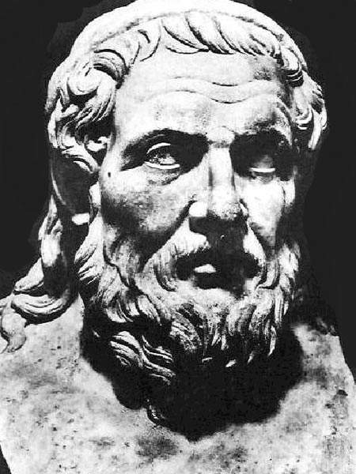
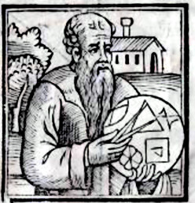

# 아폴로니우스 원뿔곡선

아폴로니오스(고대 그리스어: Ἀπολλώνιος, 기원전 262년~기원전 190년, Apollonius of Perga)는 고대 그리스의 수학자 또는 기하학자이다. 그리고 원뿔 단면에 대한 연구로 유명한 천문학자이기도 하다. 소아시아의 페르게에서 출생하였으며 이집트 알렉산드리아에서 유클리드와 함께 수학하였고 그곳에서 사망하였다. 에우클레이데스·아르키메데스와 함께 그리스의 3대 수학자로 불리운다. 그의 업적으로 원뿔 곡선의 성질과 그 단면에 대한 연구로 가장 잘 알려져있다. 타원, 쌍곡선, 포물선 등의 용어의 정의를
처음 사용하기도 하였다. 많은 책을 저술하였으나 지금까지 전해내려오는 것은 «원뿔 곡선론» 뿐이다. 또한 고대 그리스 시대에 그가 쓴 논문들은 대부분 유실되었고 제목과 내용에 대한 요약은 후대에 알렉산드리아 파푸스에 의해 전해지고 있다. 여덟 권의 책 중에서 I권, II권, III권, IV권 만이 그리스어 원본이 남아있고, V권, VI권, VII권은 Banū Mūsā 가 의뢰한 Thābit ibn Qurra의 아랍어 번역본이 남아 있고 그리스 원본은 소실되었다. 그리고 VIII권의 상태는 알 수 없으나 첫 번째 초안이 존재했었고 최종본이 제작되었는지 여부는 알려져 있지 않다. 단, Edmond Halley에 의한 "재구성"된 판이 라틴어로 존재한다.
17세기의 수학자들은 모두 아폴로니우스를 읽었다. 이 시기의 독창적인 수학 작품은 아폴로니우스의 작품에 대한 주석으로 쓰거나 아폴로니우스의 소실된 것으로 추정되는 논문의 재구성으로 쓰인 경우가 많았다. 곡선 연구에 있어서는 아폴로니우스의 연구, 특히 «원뿔 곡선론»에서 내용들을 확장하고 일반화하려는 시도가 많았다. 10세기와 11세기에 «원뿔 곡선론»에 아랍어로 추가된 중요한 월뿔 곡선의 수학적 내용이 과학 혁명의 결정적인 영향을 미쳤다.
«원뿔 곡선론»은 정의, 그림, 증명 등이 유클리드 «원론»의 논리적 구성 순서(가정, 정리, 증명, 대상에 대한 언어적 설명)를 따르고 있다. 기하학에서 움직이는 물체가 아닌 고정된 물체를 다루고 있다. 대수 표기법도, 좌표도 없었고, 실제로 수치도 없었다. I권 ~ VII권 내에는 387개의 명제가 있고 현대 기하학의 교과서의 명제의 배열도 이 책의 순서를 따르고 있다.
원뿔은 평면에서 원뿔 곡선을 축에서 평행하고 정렬된 선분의 집합으로 보는 원뿔 단면에 대한 체계적인 접근 방식이다. 이 접근 방식은 좌표 기하학의 개념과 매우 유사하다. 이러한 이유로 원뿔에서 개발된 특정 개념은 함수 개념을 개발하는 데 기본이 되었다. 원뿔에는 오늘날 거의 알려지지 않은 다양하고 아름다운 정리가 포함되어 있다. 특히 대칭, 축, 공액 지름(켤레 지름)에 대한 정리는 고등학교 수준에서 공부할 수 있으며, 사용된 주요 수학적 결과는 유사성과 기하학적 수단이다. 이러한 정리는 17세기 내내 광범위하게 사용되었는데, 예를 들어 뉴턴의 프린키피아(1952)에서 행성 궤도에 대한 논의를 위해 사용되었다.

 

## I권

I 권에는 8개 정의와 60개의 명제가 수록되어 있다. 원뿔과 원뿔 단면에 관한 기본 정의가 실려 있다. 그러나 이러한 정의는 현대적인
정의와 정확히 일치하지는 않는다. 현대의 단어는 고대에서 유래했지만 어원의 의미가 반대로 변해버린 경우가 종종 있다.

## II권

II권은 53개의 명제가 수록되어 있다. 아폴로니우스는 지름의 극한과 축, 점근선 및 관련된 성질을 다루려 했다고 한다. "지름"에 대한
그의 정의는 전통적인 것과 다르다.

## III권

III 권은 56개의 명제가 수록되어 있다. 아폴로니우스는 입체도형 궤적, 세 개 그리고 네 개 직선의 궤적을 작도하는 정리에 대한
독창적인 발견을 주장하였다.

## IV권

VI권은 57개의 명제가 수록되어 있다. 아폴리니우스는 유데무스(Eudemus)가 아닌 아탈로스(Attalus)에게 처음 보낸 편지에
수록되어있고, 그의 보다 성숙한 기하학적 사로를 보여준다. 명제들은 다소 전문적이다.

## V권

V 권은 77개의 명제가 수록되어 있다. V권은 아랍어 번역서를 통해서 알려졌다. 여덟 권 중에서 어떤 책 보다도 많은 명제를 수록하고
있다. 타원 50개, 포물선 22개, 쌍곡선 28개의 명제가 있다.

## VI권

VI권은 10개의 정의와 33개의 명제가 수록되어 있다. VI권도 아랍어 번역서를 통해서 알려졌다. 여덟 권 중에서 적은 명제를 수록하고
있다.

## VII권

VII 권에는 51개의 명제가 수록되어 있다. VII권도 아랍어 번역서를 통해서 알려졌다. 이것들은 히스(Heath)가 1896년 판에서
마지막으로 고려한 내용이 이것들이다.

## VIII권

파푸스가 설명하는 분실 및 재구성된 작품들은 다음과 같다. Cutting of a Ratio(비율의 절단), Cutting of an Area(넓이 절단),
Determinate Section(원뿔 곡선 결정), Tangencies(접선), Inclinations(경사), Plane Loci(평면 궤적).

---
