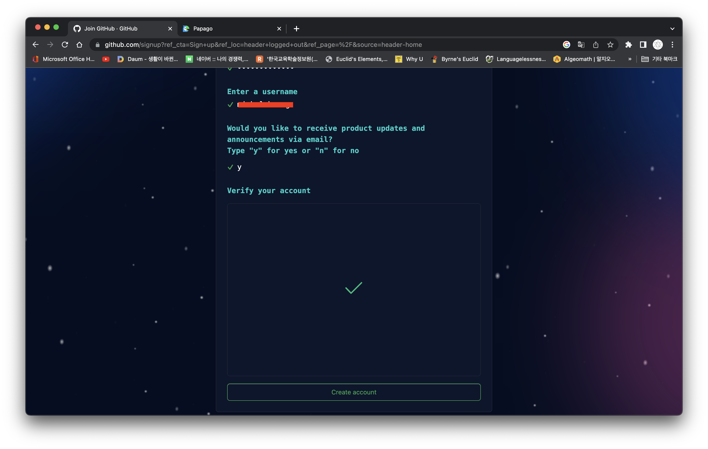

# 1. 깃허브(GitHub) 가입하기

먼저 Git에 대하여 알아보아야 한다. Git이란 다음과 같다.

> Git은 형상 관리 도구 중 하나로, 컴퓨터 파일의 변경사항을 추적하고 여러 명의 사용자들 간에 해당 파일들의 작업을 조율하기 위한 분산 버전 관리 시스템이다.
> 출처 : 위키백과

그럼 GitHub이란 무엇일까?

> 깃허브(Github)는 분산 버전 관리 툴인 깃(Git)를 사용하는 프로젝트를 지원하는 웹호스팅 서비스이다.
> 출처 : 위키백과

즉, github는 버전 관리와 협업을 위한 코드 웹 호스팅 플랫폼으로, 언제 어디서나 협업 프로젝트를 쉽게 진행할 수 있도록 돕는 역할을 한다. 어떤 프로젝트를 협업할 때, 동시에 작업을 할 수 있게 도와준다. 저장소는 자신의 컴퓨터(local)과 클라우드에 해당하는 GitHub 저장소가 있다. 이 GitHub 저장소에 자신이 작업한 파일을 올리거나 내려받을 수 있다.

오른쪽 위의 Sign up 버튼을 눌러서 계정 등록을 시작하자.

이메일을 입력하자.

패스워드를 입력하자. 안전하게 대문자와 숫자 특수문자를 조합해서 하자.

이름은 언더바(\_)를 사용할 수 없다.

업데이트 알람을 이메일로 받을 것이지(y) 받지 않을 것인지(n)를 선택하자.

확인 버튼을 누르면 두 개의 그림 맟추기 문제가 나오고 이를 잘 선택하자.

같은 그림이 있는 정사각형을 선택하자.

아래의 Create account 버튼을 누르자.

전송 받은 이메일을 열어서 받은 숫자를 확인하자.

이메일에 보이는 숫자를 입력하자.

나이와 관심이 있는 것에 대한 질문이 이어진다.

무료와 유료를 선택하고 하는데 우리는 무료를 선택하자.

이제 첫화면이 보인다. 위의 화면이 보이면 잘 설치가 된것이다.

깃허브에도 용량제한이 있다. 무료로 사용하는 것이지만 2G의 용량이 기본 주어지고 그 이상을 사용하려면 유료 서비스(github Pro, github Team, github Enterprise cloud)를 이용하여야 한다.
50M이상 파일을 올리려고 하면 경고 메세지가 뜬다. push는 되지만 그 이상 큰 파일은 Git Large File Storage를 사용하여야 한다. 자세한 내용은 "Git 대용량 파일 저장 장소 정보"를 참조하여라.
개발자들이 대용량 파일을 공유하려면 차자리 Dropbox를 사용하는 편이 좋다.
복제 속도와 작업 및 유지관리를 쉽게 하려면 리포지토리의 용량을 1G미만으로 유지하는 것이 좋다.

이제 저장소를 만들어야 한다. 위의 그림에서 왼쪽 위쪽에 Create repository 녹색 버튼이 있다. 이 버튼을 눌러서 저장소를 만들자.

저장소 이름을 정하고 나는 'manim-mathani'라 정하였다. 그리고 이에 대한 설명을 간단히 적어도 되고 빈칸으로 남겨도 된다. 욥션이다.
공개(public)를 선택한다.

아래에 보이는 Create repository 녹색 버튼을 누르면 저장소가 만들어진다.

저장소 첫 화면이다. 아래에 주소가 보인다. 이 주소를 복사하여 로컬 컴퓨터에서 git 초기화에 필요한 녀석이다. 그리고 git 초기화를 이렇게 하세요 하는 아주 자세한 설명도 있다. 순서대로 따라하면 된다.

github에 다시 접속을 하면 위의 화면과 같이 초기화면이 바뀌어 있다. 왼쪽 위를 보면 막 만든 저장소 이름이 보이고 녹색의 new 버튼이 보인다. 새로운 저장소를 만들려면 이 버턴을 눌러 만들면 된다.
