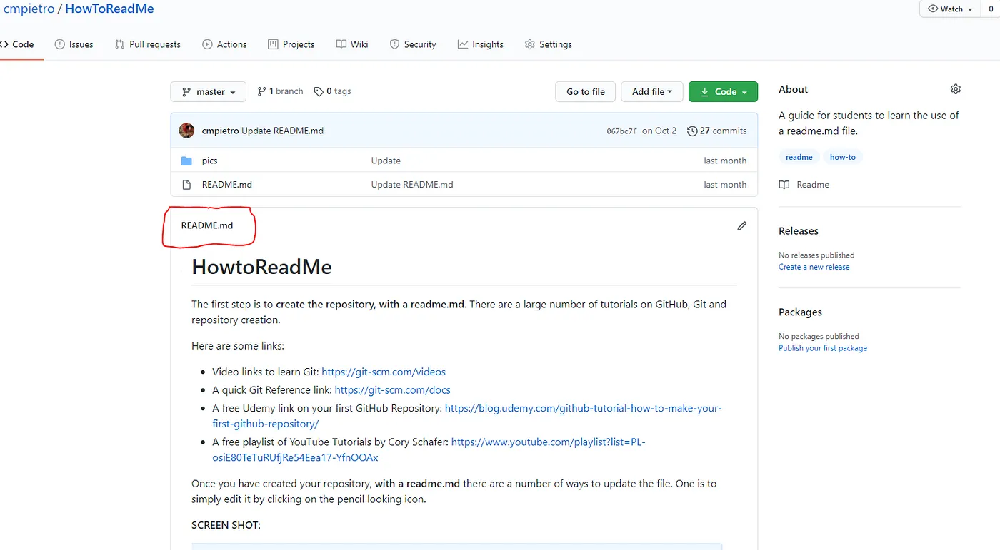

# 2장 git 사용법


## 2.1절 git 설치하기(윈도우)

윈도우의 경우 아래 Git 다운로드를 받아 설치를 하자.
[Git 다운로드 바로가기 : https://git-scm.com/download/](https://git-scm.com/download/)

## 2.2절 git 설치하기(맥)

터미널에서 Homebrew를 이용하여 설치를 하자.

```bash
brew install git
```

## 2.3절 git 설정하기

이제 로컬 컴퓨터에서 작업을 해야 한다. 맥의 경우 터미널(Terminal)에서 윈도우에서는 베쉬쉘(bash shell)에서 입력을 하면된다. 베쉬쉘은 윈도우에 내장되어 있으므로 인터넷을 검색을 통해서 설치를 하자.
우선 git을 위한 폴더를 하나 만들자. 폴더를 만드는 명령어는 아래와 같은 형식을 따른다.

> mkdir [옵션] [디렉토리 이름]

나는 git_michol92라는 폴더를 만들었다. 옵션은 필요치 않고 아래와 같이 입력한다.

```bash
mkdir git-michol92
```

그러면 아래와 같은 폴더가 만들어 진다. 폴더가 만들어 졌는지를 확인하자. 터미널 창에 ls 명령어를 입력하자.

```bash
ls
```

폴더가 만들어졌다.


만들어진 로컬 git 저장소 폴더(git_michol92)로 이동하자.

```bash
cd git_michol92
```

### git config

Git 사용자 정보를 설정한다. 최조 1회만 실행하면 된다. 형식은 다음과 같다.

> git config --global user.name "<github의 등록 이름>"
> git config --global user.email "<github의 등록 이메일>"

아래와 같이

```bash
git config --global user.name "michol92-hwang"
git config --global user.email "michol92@daum.net"
```

그리고 잘 되었는지 확인을 하자.

```bash
git config --list
```

### git init

프로젝트나 버전관리를 원하는 위치(git_michol92)에서 명령어를 실행해야 한다.

```bash
git init
```

그럼 터미널 창의 명령어어 줄이 '(base) → git_michol92 git:(main) ⤬' 와 같이 변해있는 것을 볼 수 있다.


### README.md 파일 만들기

이제 아래와 같이 터미널 창에 입력을 한다. echo 명령어는 문서파일을 만들고 "<내용>" 안의 내용을 화일명 README.md로 만들라는 것이다. 형식은 아래와같다.

> echo "[글자]" >> [파일]: 파일에 글자 추가

아래와 같이 입력하자.

```bash
echo "# manim-mathani" >> README.md
```

ls 명령어로 README.md가 생성되었음을 알 수 있다. 이는 파일형식은 MarkDown이다.

### REAME.md를 원격 저장소에 올리기

원격 저장소인 github에 올리는 순서는 다음과 같이
add ➡︎ commit ➡︎ push
순으로 한다.

처음에 꼭 README.md를 git으로 올려주어야 한다. 차례로 명령어를 실행하자.

```bash
git add README.md
```

commit시 "<내용>"은 원하는 것을 적으면 된다.

```bash
git commit -m "first commit"
```

아래 두 명령어는 이번 한 번만 하면 된다.

```bash
git branch -M main
```

주소는 github에세 있는 주소(https://github.com/michol-hwang/manim-mathani.git)를 복사하여 넣는다. 본인의 github에 있는 주소를 복사하여 넣자.

```bash
git remote add origin https://github.com/michol-hwang/manim-mathani.git
```

```bash
git push -u origin main
```

자신의 github를 보면 README.md 파일이 올라가 있는 것을 볼 수 있다.



이제 세 단계만을 기억하자.
**add ➡︎ commit ➡︎ push**

원격 저장소에 올릴 파일 또는 폴더를 add를 한다. commit를 하고 push를 통해서 원격 저장소에 저장한다.
예를 들어 test.py를 작성하고 이 파일을 올려 보자. 맨 앞의 명령어 git은 git 명령어 대시 상태를 나타낸다. git status는 git add 한 파일 및 폴더를 요약 정리하여 알려준다. add를 잘 하였는지 확인용이다. 한번도 올리지 않은 파일도 보여준다.

```bash
git_michol92 git:(main) ⤬ git add text.py
git_michol92 git:(main) ⤬ git status
git_michol92 git:(main) ⤬ git commit -m "new file"
git_michol92 git:(main) ⤬ git push -u origin main
```

전체 폴더를 add 할 수도 있다. 그럴 때는 다음과 같이 한다.

```bash
git add .
```

여기서 '.'은 모든 파일 및 폴더를 add 한다.
