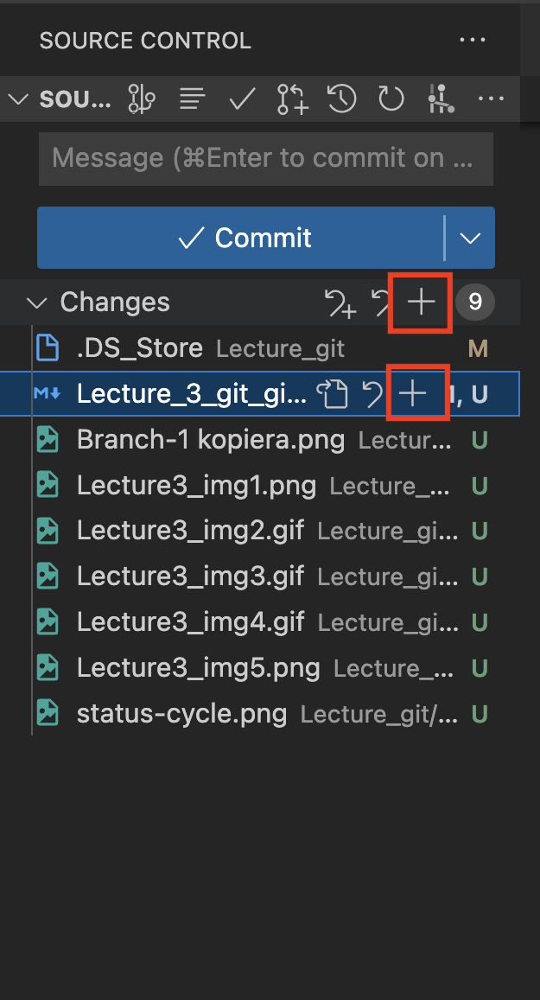

# 3장 Vscode에서 git 사용하기

코드개발에 버전관리시스템을 사용하는게 얼마나 유용한지 널리 알려졌지만 CLI 모드에서 사용되는 Git의 특성상 GUI 모드가 익숙한 사람들이 사용하기에는 한계가 있는 것은 공연한 사실이다. VSCode에 내장된 Git 명령은 CLI가 익숙하지 않은 사용자도 Git을 쉽게 사용할 수 있도록 지원하고 있으나 아직은 VSCode에서 몇 가지 Git 명령은 터미널에서 명령을 내려야만 한다.
먼저 몇가지 유용한 Vscode 확장프로그램 Git History, GitLens, Git graph)에 대하여 알아보자.

## GitLens

Git의 대부분의 기능을 GUI 모드로 VScode에서 사용할 수 있도록 제공해주고 있다.
그중 리비젼 내비게이션을 이용한 문서 별 변경 내용 비교와 커밋정보제공은 유용하게 사용할 수 있는 기능이다.
VSCode 화면 오른쪽 상단에 있는 GitLens의 리비젼 네비게이션 단추들은 해당 파일의 변경된 history를 확인하는데 편리다. 다음 그림에서와 같이 간단하게 이전, 뒤로 버튼을 클릭해서 파일의 history를 VSCode에서 확인할 수 있다.
커밋 중 오래전 커밋을 선택해서 보고 싶다면 리비젼 버튼을 alt 키와 함께 클릭하면 해당 파일에 대한 리비젼 목록이 표시된다.

## Git Graph

Git Graph는 Git 히스토리를 그래픽으로 보기 위해 소스트리를 사용하시던 분들도 그냥 VSCode를 사용할 수 있게 해주는 확장프로그램이다. 단순히 Git의 로그를 대체하는 명령뿐만이 아니라 다양한 Git 명령을 수행할 수 있는 Git을 위한 확장프로그램이다. Git Graph를 통해 각 커밋에 대한 레퍼런스와 파일에 대한 변경된 내용을 비교해 줄 뿐만 아니라 Git의 많은 명령을 마우스 오른쪽 버튼을 클릭 해 수행할 수 있다.

## Git History

Git History 는 히스토리 , 히스토리내 검색, 비교 기능을 제공한다. Git History는 리포지토리에 대한 Git 히스토리 뿐만 아니라 히스토리내 검색을 커밋내용,브랜치, 작성자이름 별로 검색할 수 있는 기능을 제공한다. 리포지토리 히스토리뿐만 아니라 페이지 히스토리, 문서 내 라인 히스토리 정보를 제공해주며, 변경된 내용을 비교 기능을 제공하며 Git 명령 들도 제공해 준다.

## Vscode에서 git 하기

그럼 이제 Vscode에서 git을 하여 보자. 이 글의 md 파일을 git으로 저장소에 올려보자.
우선 git 하는 순서를 생각하여 보자. add -> commit -> push를 한다.

Vscode에서 위 세 가지 git 확장프로그램을 설치를 하였다. 원래 Vscode에서는 기본적으로 git을 지원해 준다. 2장에서 이미 git을 초기화하였다. 따라서 그냥 아래 그림 처럼 초기 initialize Repository 버튼을 누르면 된다. 꼭 나의 컴퓨터 git 폴더 위에서 Vscode를 실행시키고 이 버튼을 눌러야 한다.

아래 그림에서 push 되지 않은 파일 9 개수인 숫자 9가 오른쪽 위에 보일 것이다. 또한 M, U라는 알파벳이 보인다. U는 untraked의 약자로 push가 한번도 되지 않은 새 파일을 알려준다. 또한 M은 Modified의 약자로 한 번 이상 push된 파일이고 수정된 파일임을 보여준다.

파일 오른쪽의 + 표시를 누르는 것으로 add 상태로 바뀐다. 저장소로 올려지기 전의 중간단계로 staging 되었다는 것을 보여준다.

그러면 아래 그림과 같이 선택한 파일의 상태가 A로 바뀌고 파일이 staged Changes 영역으로 옮겨진다.

staged Changes 영역에 있는 파일은 - 상태를 선택할 수 있고 이를 누르면 다시 Change 영역으로 파일이 옮겨진다.

Change 바에 마우스를 갖다 대면 +보이고 이를 누르면 change 영역에 있는 모든 파일을 staging 상태로 바꾼다.

이제 Messges 창에 메세지(나중에 상태를 확인할 수 있는 문구를 넣으면 좋다. 그러나 간단한 문구를 넣다.)를 입력한다. 그리고 soure contral 바에 있는 V 버튼을 누르면 레포지토리에 파일이 올라간다. 수정된 파일이어도 올라가고 나중에 오류가 있으면 hostory에서 이를 찾아 다시 정정할 수 있다. 일단 올려보자.

우선 녹색의 v commit 버튼을 누르면 commit의 상태가 된다. 그리고 녹색 버튼이 Sync Changes 버튼으로 바뀐다. ==꼭 commit 위의 메세지 창에 메세지를 작성하자.== 만약 비어 있는 사애로 commit 버튼을 누르면 계속 돌아기기만하고 commit가 되지 앟는다. 버튼을 누르면 파일 목록이 없어진다. 녹색 Sync Changes 버튼을 누르자. 이 버튼을 누르는 것이 push를 하는 것이다.

 

이미지 파일들은 img 폴더에서 확인할 수 있다. 현 위치에서는 Lecture3_git_github_vcode.md 파일이 올라가 있는 것을 확인할 수 있다.

파일들이 올라가지 않은 상태의 gitHub

파일이 올라간 상태 gitHub

## 참고문헌

[[VSCode] Git을 위한 비주얼스튜디오 확장프로그램 ( extension ) 추천(2022.09.03.)](https://usingu.co.kr/frontend/vscode/git을-위한-유용한-vscode-확장프로그램-extension-추천/)
