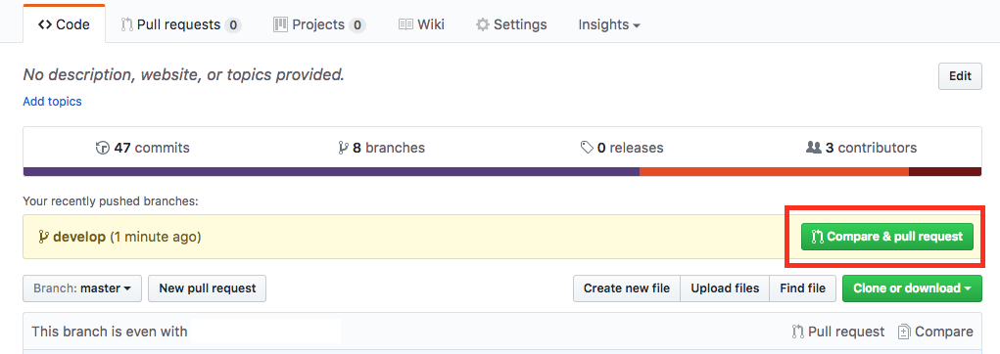
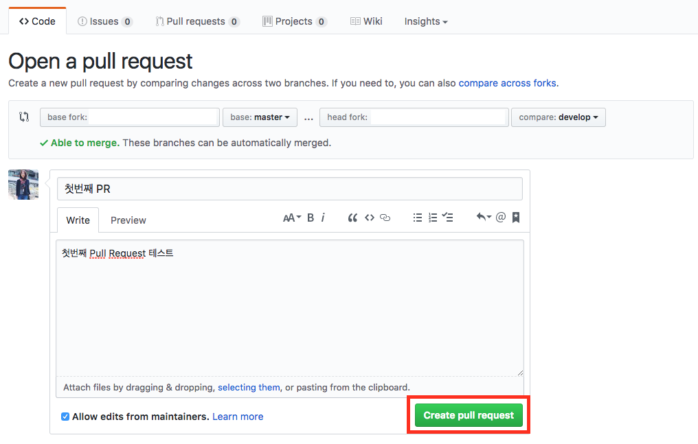

# github를 이용해 협업하기

기본 사용법은 팀 리더와 팀 원 모두 사용하기 위해서 익혀야할 내용이다.

## git 기본 사용법

github 계정이 존재하고 Repository를 생성했다는 가정하에 진행함.

1. 환경설정

git을 사용하기 위해 환경설정을 하자. 컴퓨터마다 처음에만 해주는 작업이다.

```bash
git config --global user.name "내 이름"
git config --global user.email "내 이메일"
git config --list
```

git config --list는 환경설정이 잘 되었는지 확인용이다.

2. git 초기화 하기(git Initiallize)

git을 초기화 해준다. 프로젝트를 맨 처음 올릴 때만 해주면 된다.

```bash
git init
```

3. Add

작성한 파일을 전부 add 한다.
특정 파일만 add하려면 . 대신 파일명을 작성한다.

```bash
git add .
```

'.'은 모든 파일을 의미한다.

1. Commit

작성한 파일의 History를 만들어준다. 예를 들어 어떤 내용을 변경했는지 등등 적는 다. 간편하게 적는다.

```bash
git commit -m "commit에 대한 메시지"
```

5. Repository와 연결

내 코드를 보내기 위해서 github에 만든 메인 Repository와 작성한 소스코드가 존재하는 폴더를 연결해준다.

```bash
git remote add origin [Repository주소]
```

이 작업도 모든 작업 컴퓨터에서 한 번만 실행을 해주면 된다.

6. Push

지정한 Branch에 소스코드를 보낸다.

```bash
git push origin [Branch이름]
```

해당 작업을 끝내면 github에 첫 소스코드가 올라간 것을 확인할 수 있다.
이 다음부터는 소스코드를 수정/작성하고 3->4->6의 과정을 반복하면 된다.

# 협업하기

하나의 프로젝트가 운영되고 팀 리더와 팀원이 진행한다고 가정하자.

## 팀장

팁장은 프로젝터를 github에 repository를 만든다.

## 팀원

팀워은 팀 리더가 만든 github Repository에 메인으로 하여 프로젝트를 진행하여야 한다.

1. Clone

팀원은 프로젝트를 수행하기 위해 github에 올라온 소스코드를 다운 받아야 한다. 이 때 본인이 프로젝트를 저장할 폴더 위치에서 명령어를 실행하여야 한다.
폴더명을 제외하고 입력하면 repository명과 동일하게 생성한다.

```bash
git clone [repository 주소] [폴더명]
```

2. 프로그램 개발
   다운로드 받은 소스코드에서 팀원이 맡은 부분을 개발하고 기본 사용법 3, 4 과정을 실행한다.

```bash
git add [파일명 또는 폴더명]
git commit -m "메세지 내용"
```

3. Branch 생성 및 전환하기

브랜치 생성은 팀장이 할 수 있다.

```bash
git branch [브랜치명]
```

repository가 manin branch로 이곳에 최종 개발한 소스 파일들이 올라가는 곳이다. 그러므로 팀원 개인별 branch를 생성해주어야 한다.(에러 방지를 위함이다.)

팀원은 만들어 놓은 브랜치로 전환하여야 한다.

```bash
git checkout -b [브랜치명]
```

4. push

팀원은 생성한 소스를 팀장으로 부터 할당 받은 branch에 올린다. 물론 add와 commit은 기본이다.

```bash
git push origin [개인별 할당 받은 브렌치명]
```

```bash
git branch
```

위와 같이 입력하면 만들어진 branch를 확인할 수 있다.

5. Compare & pull request

push 이후에 자신의 github에 접속하여 Repository에서 페이지를 새로고침 해보면 새로운 branch를 생성해 push했다는 알림 메시지와 함께 Compare & pull request 버튼을 볼 수 있다.



Pull request(PR)은 팀원의 소스코드를 main branch에 올리기 전에 팀장에게 확인받는 과정이라고 생각하면 된다.
팀장은 팀원에게 남길 메시지와 함께 create pull request를 한다.



## 팀 리더

1. Pull request 확인

팀장은 Repository의 상단 Pull request 메뉴에 PR이 추가된 것을 확인할 수 있다.
팀원이 작성한 PR을 클릭해 확인한다.
팀장은 팀원이 작성한 소스코드를 확인한 후
수정사항이 있으면 => Review changes
문제가 없다면 => Merge pull request -> Confirm merge
를 한다.

2. pull

팀장도 함께 개발 진행중이다. 그러므로 팀장이 작성중인 소스코드와 Merge된 최종 버전의 소스코드가 일치하지 않게 되어 Version을 맞춰줘야한다. 즉, 동기화 해주어야 한다. 이 때, 우선 충돌이 발생할 수 있으므로 팀장이 작성중이던 소스코드를 저장해줘야 한다.

```bash
git add .
git commit -m "commit 메시지"
```

변경 내용을 비교해보고 싶으면 diff를 실행해준다

```bash
git diff [기존 branch] [비교할 branch]
```

main branch와 동기화해준다. 이 작업을 하면 pull을 실행하면 팀장이 작성한 소스코드와 팀원이 작성한 소스코드가 합쳐진다.

```bash
git pull origin main
```

3. push

동기화 후 팀장이 작성한 소스코드까지 개발이 완료되면 push 해 준다.
실제로는 팀장도 본인의 branch로 진행을 할것이다.

```bash
git push origin main
```

4. 완료
   팀장과 팀원의 소스코드가 합쳐져 main branch에 올라간 것을 확인할 수 있다.
