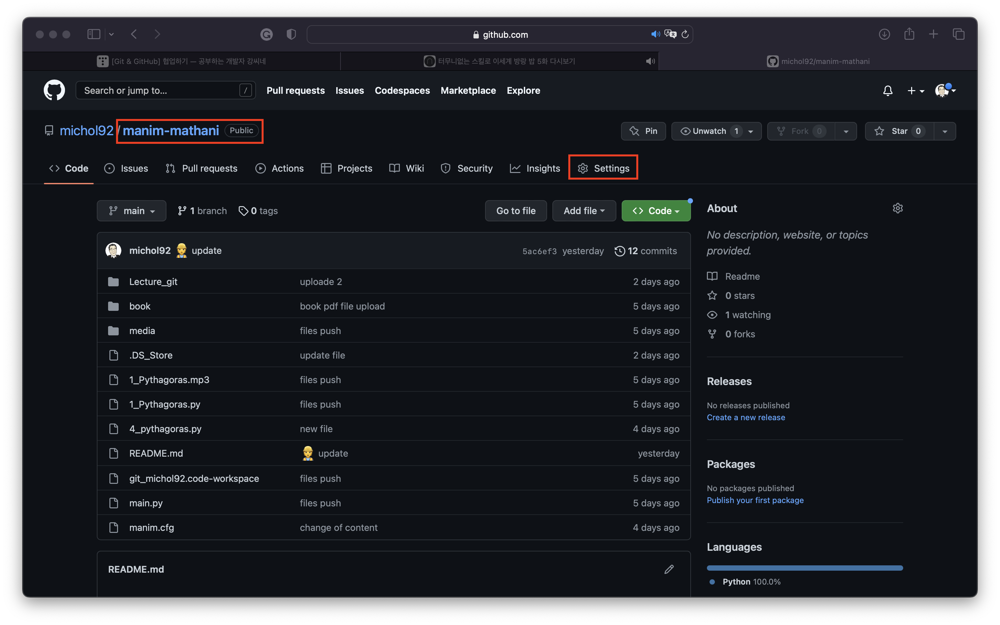
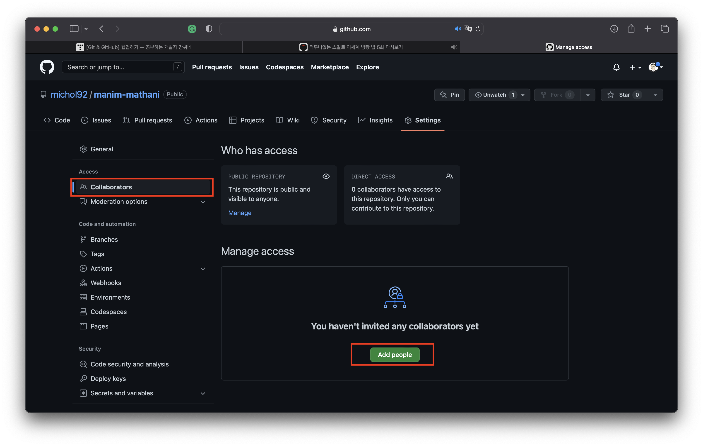
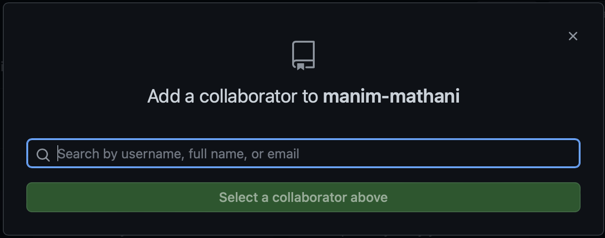

# 협엄하기

## 공동 작업자 추가하기

gitHub의 공개 저장소는 주소만 알면 누그든지 소스를 볼 수 있다. 또한 gitHub 회원이면 누구나 오픈 소스에 접근하여 파일을 내려받을 수 있다. 하지만 주소를 안다고 해도 내가 작성한 파일을 접근한 공개 저장소에 add-commit-push을 할 수 있는 것은 아니다.
팀장, 팀원 1, 팀원 2가 공동작업을 한다고 가정을 하자.
그럼 보통 팀장이 github 저장소를 만든다. manim-mathani를 저장소를 만들었다고 가정하자. 저장소로 접속을 하고 settings 버튼을 누르자.

그러면 왼쪽 메뉴가 보이고 collaborators를 선택하자. 그리고 아래 중간에 보면 녹색의 'Add people' 버튼이 있다. 이 버튼을 누르자.

초대할 사람을 username 또는 email으로 초대할 수 있다. 그래서 아래 그림의 입력 폼에 username 또는 email을 적고 'Sellect a collaborator above' 버튼을 누르자. 그러면 초대가 된다.


## 원격 저장소에 첫 commit-push 하기

먼저 팀장이 원격 저상소를 연결하고 test.md 파일을 만들어 원격 저장소의 main 브랜치에 push를 하자.

```git
git remote add origin [원격 저장소 URL]
echo 'Manim-mathani project' >> test.md
git add test.md
git commit -m "collaboration test"
git push -m origin main
```

그러면원격 저장소에 test.md 파일이 보일 것이다.

## 공동 작업자(팀원1, 팀원2) 로컬 pc에 원격 저장소를 clone하기

공동 작업자인 팀원 1, 팀원 2는 팀장이 만들어 놓은 원격 저장소를 clone하여야 한다.

```git
git clone [원격 저장소 주소]
```

## 첫 번째 commit이 아니라면 pull을 하자

github로 협업을 할 때는 여러 사람이 함께 문서를 수정하고 commit-push를 하기 때문에 반드시 pull로 원격 저상소의 최신 commit를 당겨운 다음 자신의 commit를 push하여야 한다. 아직 브랜치를 만들지 않고 main에서만 변경하는 것으로 하자.

팀원 1, 팀원 2 모두 clone을 하였다고 하자.

팀장이 다른 문 test00.md를 만들고 commit 하고 push를 하였다고 하자.

그리고 팀원 1인 test01.md를 작성하여 'uploade test01.md'라는 commit를 하고 push를 한다고 하자.

```git
git add test01.md
git comm -m "uploade test01.md"
git push -m origin main
```

그러면 ![rejected]로 시작하는 오류 메세지가 출력된다. 이것은 팀원 1의 로컬 pc에 새로운 commit 내역이 존재 하지 않기 때문에 발생하는 오류이다. 따라서 commit을 하기 전에 pull로 먼저 당겨와야 한다. pull명령을 사용하여 당겨오는 경우 자동으로 vim이 실행되면서 commit message가 표시된다. 원하는 내용으로 추가해도 되고 기본 메세지를 사용해도 된다.

```git
# git pull [원격저장소 명] [브랜치 명]
git pull origin main
```

pull로 당겨왔기 때문에 원격 저상소의 최선 commit을 당겨왔으므로 이제 commit을 할 수 있다. 이미 add 된 상태이므로 commit부터 하면 된다.

```git
git comm -m "uploade test01.md"
git push -m origin main
```

## branch로 push하기

협업을 할 때는 각기 다른 기능 또는 별개의 작업을 하는 경우가 대부분이다. 이러한 경우 main branch와 섞이지 않도록 새로운 branch를 만들어 협업을 하여야 한다. 모두 다 새로운 branch에서 원격 저장소로 push 할 수 있다.
branch는 팀장, 팀원1, 팀원2 모두 만들 수 있다.
팀원 1은 원격 저장소에 다른 팀원들의 commit이 추가되어 있을 수 있어 이를 확인하기 위해서 pull을 하자.

```git
git pull
```

그리고 이제 새로운 작업을 위해서 로컬 컴퓨터에 새로운 branch를 만들고 이름을 team1으로 하고 바로 만든 branch로 이동 한다.(이때 checkout 하였다고 한다.)

```git
git branch -b team1
```

-b 플래그는 branch를 만드고 바로 만든 branch로 이동하라는 것이다.

문서 test02.py를 만들고 commit을 한다.

```git
git add test02.py
git commit -m "test02.py in branch team1"
```

원격 저장소에 branch 까지 원격 저장소에 push 하기 위해서 git push 뒤에 origin 브랜치 명으로 적어주면 원격 저장소에 새로은 브랜치를 push 한다.

```git
git push origin team1
```

## pull request로 push한 branch merge 하기

원격 저장소의 파일목록에는 team1 브랜치에서 만들었던 test.py 파일이 없다.
push한 브랜치는 pull request를 통해 병합해야 원격 저장소에 반영이 되기 때문이다.
​

1. branch 설명 옆에 New pull request 버튼을 클릭한다.
   ​
1. 풀 리퀘스트에 대한 메세지를 작성 한 후 Create pull request를 누르면 협업중인 저장소에 풀 리퀘스트가 전송된다.
   ​
1. 협업중인 원격 저장소에 등록된 풀 리퀘스트는 공동 작업자 중 누구나 병합할 수 있다.
   저장소 파일 목록 위의 Pull request를 누르면 등록된 풀리퀘스트 목록이 나온다.
   ​
1. 풀 리퀘스트 메세지를 살펴본 다음 이상이 없으면 Merge pull request를 누럴 병합한다.
   필요하다면 이 공간을 통해 풀 리퀘스트를 남긴 사람과 메시지를 주고 받을 수도 있다.
   ​
1. 커밋 메시지를 직접 입력하거나 기본메세지를 사용할수 있습니다. Confirm merge 버튼을 누르면 브랜치 병합이 마무리된다.
   ​
1. 브랜치가 병합되면 해당 브랜치에 있던 파일이 master 화면에 나타납니다. 브랜치 상태를 알고 싶다면 파일 목록 위에 있는 '2 branches'를 누르자.
   ​
1. 브랜치가 병합된 상태라면 'merged'라고 표시된다. 또한 어떤 협업자가 브랜치를 병합했는지도 알수 있다.
   ​
1. 깃허브에서 협업을 할 때는 보통 작업자 마다 브랜치를 만들어서 진행하고, 작업 중간중간 풀리퀘스트를 보내서 manin 브랜치에 병합한다. 그래서 깃허브로 협업을 할 때는 다른 작업자의 변경 내용을 바로 반영하기 위해 항상 pull을 먼저 당긴후에 자신의 작업을 진행하는 것을 권장한다.
