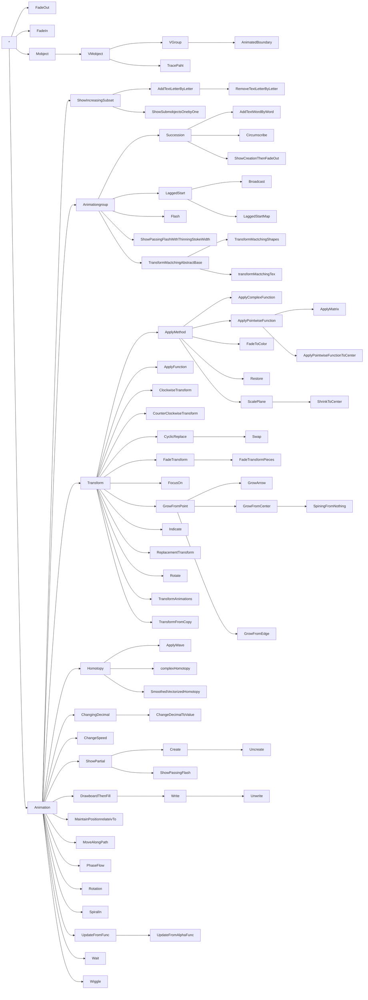

```mermaid
graph LR
* --> FadeOut
* --> FadeIn
* --> Mobject
* --> Animation
Mobject --> VMobject
VMobject --> VGroup
VGroup --> AnimatedBoundary
VMobject --> TracePaht
Animation --> ShowIncreasingSubset
ShowIncreasingSubset --> AddTextLetterByLetter
AddTextLetterByLetter --> RemoveTextLetterByLetter
ShowIncreasingSubset --> ShowSubmobjectsOnebyOne
Animation --> Animationgroup
Animationgroup --> Succession
Succession --> AddTextWordByWord
Succession --> Circumscribe
Succession --> ShowCreationThenFadeOut
Animationgroup --> LaggedStart
LaggedStart --> Broadcast
LaggedStart --> LaggedStartMap
Animationgroup --> Flash
Animationgroup --> ShowPassingFlashWithThinningStokeWidth
Animationgroup --> TransformMactchingAbstractBase
TransformMactchingAbstractBase --> TransformMactchingShapes
TransformMactchingAbstractBase --> transformMactchingTex
Animation --> Transform
Transform --> ApplyMethod
ApplyMethod --> ApplyComplexFunction
ApplyMethod --> ApplyPointwiseFunction
ApplyPointwiseFunction --> ApplyMatrix
ApplyPointwiseFunction --> ApplyPointwiseFunctionToCenter
ApplyMethod --> FadeToColor
ApplyMethod --> Restore
ApplyMethod --> ScalePlane
ScalePlane --> ShrinkToCenter
Transform --> ApplyFunction
Transform --> ClockwiseTransform
Transform --> CounterClockwiseTransform
Transform --> CyclicReplace
CyclicReplace --> Swap
Transform --> FadeTransform
FadeTransform --> FadeTransformPieces
Transform --> FocusOn
Transform --> GrowFromPoint
GrowFromPoint --> GrowArrow
GrowFromPoint --> GrowFromCenter
GrowFromCenter --> SpiningFromNothing
GrowFromPoint --> GrowFromEdge
Transform --> Indicate
Transform --> ReplacementTransform
Transform --> Rotate
Transform --> TransformAnimations
Transform --> TransformFromCopy
Animation --> Homotopy
Homotopy --> ApplyWave
Homotopy --> complexHomotopy
Homotopy --> SmoothedVectorizedHomotopy
Animation --> ChangingDecimal
ChangingDecimal --> ChangeDecimalToValue
Animation --> ChangeSpeed
Animation --> ShowPartial
ShowPartial --> Create
Create --> Uncreate
ShowPartial --> ShowPassingFlash
Animation --> DrawboardThenFill
DrawboardThenFill --> Write
Write --> Unwrite
Animation --> MaintainPositionrelateivTo
Animation --> MoveAlongPath
Animation --> PhaseFlow
Animation --> Rotation
Animation --> SpiralIn
Animation --> UpdateFromFunc
UpdateFromFunc --> UpdateFromAlphaFunc
Animation --> Wait
Animation --> Wiggle

```
