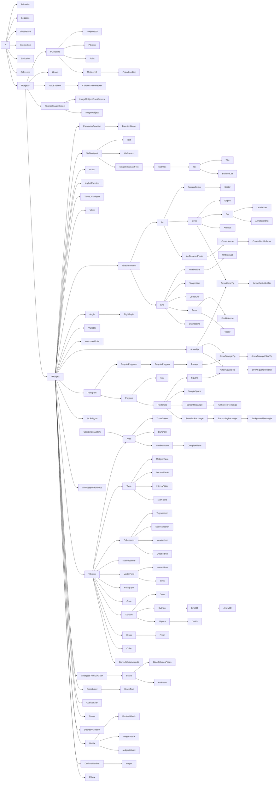

# Mobjects

```mermaid
graph LR
* --> Animation
* --> LogBase
* --> LinearBase
* --> Intersection
* --> Exclusion
* --> Difference
* --> Mobjects
Mobjects --> PMobjects
Mobjects --> Group
Mobjects --> ValueTracker
Mobjects --> AbstracImageMobject
Mobjects --> VMobject
PMobjects --> Mobjects2D
PMobjects --> PGroup
PMobjects --> Point
PMobjects --> Mobject1D
Mobject1D --> PointcloudDot
ValueTracker --> ComplexValuetracker
AbstracImageMobject --> ImageMobjectFromCamera
AbstracImageMobject --> ImageMobject
VMobject --> ParameterFunction
ParameterFunction --> FunctionGraph
VMobject --> SVGMobject
SVGMobject --> Text
SVGMobject --> Markuptext
SVGMobject --> SingleStrignMathTex
SingleStrignMathTex --> MathTex
MathTex --> Tex
Tex --> Title
Tex --> BulletedList
VMobject --> Graph
VMobject --> ImplicitFunction
VMobject --> ThreeDVMobject
VMobject --> VDict
VMobject --> TipableMobject
TipableMobject --> Arc
TipableMobject --> Line
Arc --> AnnularSector
AnnularSector --> Sector
Arc --> Circle
Circle --> Ellipse
Circle --> Dot
Dot --> LabeledDot
Dot --> AnnotationDot
Circle --> Annulus
Circle --> ArrowCircleTip
ArrowCircleTip --> ArrowCirclefilledTip
Arc --> AcrBetweenPoints
AcrBetweenPoints --> CurvedArrow
CurvedArrow --> CurvedDoubleArrow
Line --> NumberLine
NumberLine --> UnitInterval
Line --> Tangentline
Line --> UnderLine
Line --> Arrow
Arrow --> DoubleArrow
Arrow --> Vector
Line --> DashedLine
VMobject --> Angle
Angle --> RightAngle
VMobject --> Variable
VMobject --> VectorizedPoint
VMobject --> ArrowTip
ArrowTip --> ArrowCircleTip
VMobject --> Polygram
Polygram --> RegularPolygram
RegularPolygram --> RegularPolygon
RegularPolygon --> Triangle
Triangle --> ArrowTriangleTip
ArrowTriangleTip --> ArrowTriangleFilledTip
ArrowTip --> ArrowTriangleTip
Polygram --> Polygon
Polygon --> Star
Polygon --> Rectangle
Rectangle --> Square
Square --> ArrowSquareTip
ArrowSquareTip --> arrowSquareFilledTip
ArrowTip --> ArrowSquareTip
Rectangle --> SampleSpace
Rectangle --> ScreenRectangle
ScreenRectangle --> FullScreenRectangle
Rectangle --> RoundedRectangle
RoundedRectangle --> SurrondingRectangle
SurrondingRectangle --> BackgroundRectangle
VMobject --> ArcPolygon
VMobject --> ArcPolygonFromArcs
VMobject --> VGroup
VGroup --> Axes
CoordinateSystem --> Axes
Axes --> ThreeDAxes
Axes --> BarChart
Axes --> NumberPlane
NumberPlane --> ComplexPlane
VGroup --> Table
Table --> MobjectTable
Table --> DecimalTable
Table --> IntervalTable
Table --> MathTable
VGroup --> Polyhedron
Polyhedron --> Tegrahedron
Polyhedron --> Dodecahedron
Polyhedron --> Icosahedron
Polyhedron --> Octahedron
VGroup --> ManimBanner
VGroup --> VectorField
VectorField --> streamLines
VectorField --> torus
VGroup --> Paragraph
VGroup --> Code
VGroup --> Surface
Surface --> Cone
Surface --> Cylinder
Cylinder --> Line3D
Line3D --> Arrow3D
Surface --> Shpere
Shpere --> Dot3D
VGroup --> Cross
Cross --> Prism
VGroup --> Cube
VGroup --> CurveAsSubmobjects
VMobject --> VMobjectFromSVGPath
VMobjectFromSVGPath --> Brace
Brace --> BracBetweenPoints
Brace --> AcrBrace
VMobject --> BraceLabel
BraceLabel --> BraceText
VMobject --> CubicBezier
VMobject --> Cutout
VMobject --> DashedVMobject
VMobject --> Matrix
Matrix --> DecimalMatrix
Matrix --> IntegerMatrix
Matrix --> MobjectMatrix
VMobject --> DecimalNumber
DecimalNumber --> Integer
VMobject --> Elbow
```
