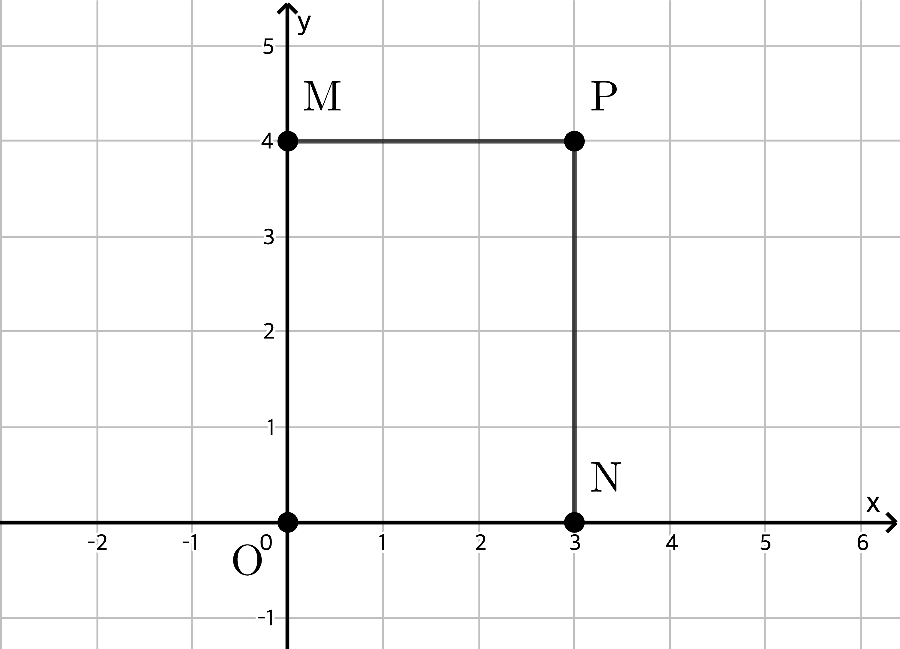
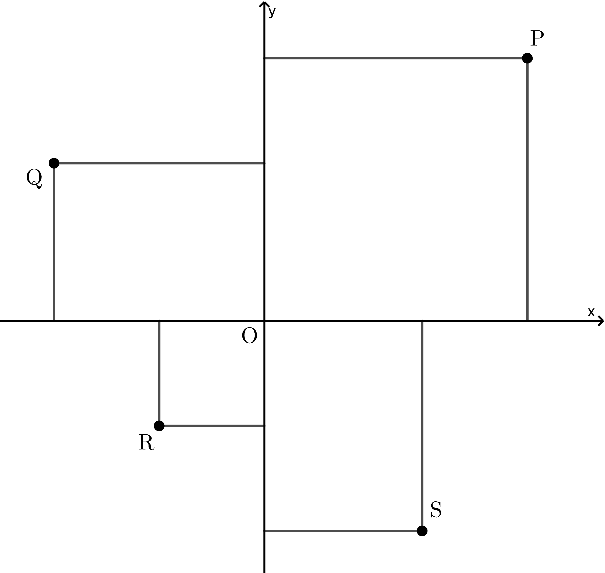
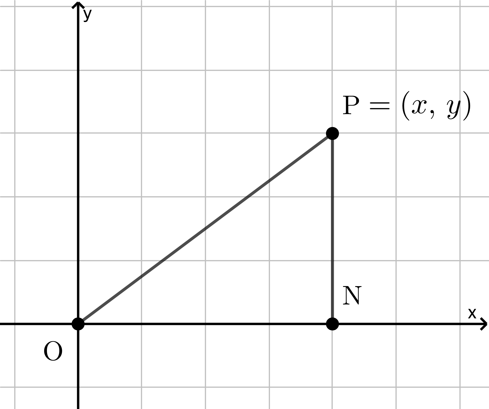
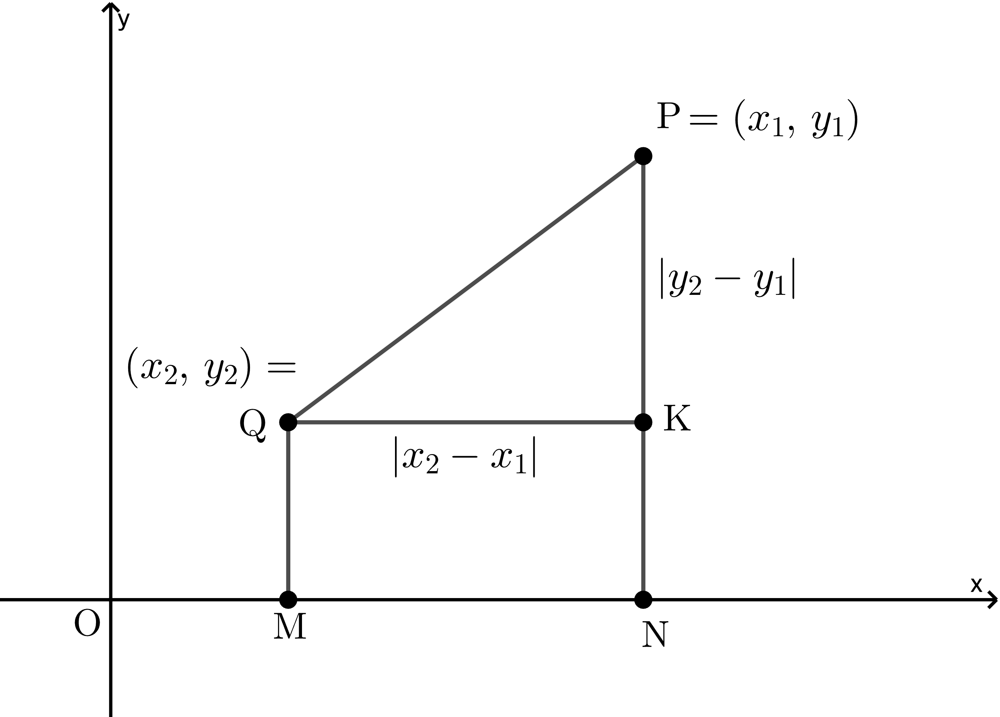
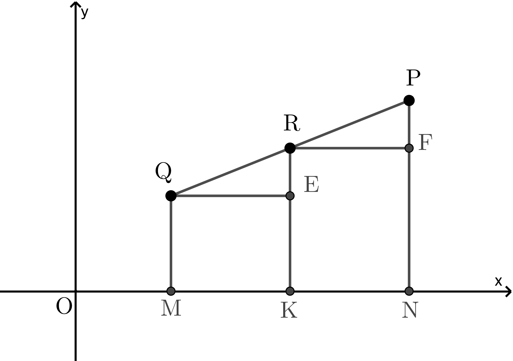

# 1. 직교 좌표계

대수학, 해석학, 기하학에서, 기하학을 돕기 위해 대수학을 적용시킬 것이다. 대수적 기호의 도움으로, 평면 위의 점 위치를 어떻게 나타내야 하는지를 논의할 것이며 그리고 직선 또는 곡선을 나타내기 위해서 방정식을 어떻게 표현해야 하는지를 다룰 것이다. 방정식으로 부터 그들을 대표하는 곡선의 기하학적 성질을 알아낼 것이며 알려진 곡선의 방정식에 대한 그래프를 어떻게 그려야 하는지에 대한 방법을 다룰 것이다.

이러한 생각들이 학생들에게는 전혀 낯설지 않기를 바란다. 중·고등학교 학생들은 다음과 같은 식
$$\left(a+b\right)\left(a-b\right)=a^2-b^2$$
의 대수적 공식의 기하학적 해석과 이것을 간결한 그래프로 어떻게 그리는지 그리고 이차대수식 표현에 대하여 배운 적이 있을 것이다. 이러한 주제에 대한 연구에서, 무엇보다도 이 책을 처음 공부하는 학생들은 기하학과 조합이 포함된 대수학을 다루고 있다는 것을 기억해야 한다. 그러므로 학생들은 대수식을 다루는 것을 기하학적 도형으로 설명하는 습관을 가져야 한다. 그렇게 함으로써, 학생들은 자신의 문제 풀이 과정에서 많은 어려운 것들을 없앨 것이다. 더군다나, 잘 그려진 기하학적 그림을 보면, 결과는 종종 대수학 연구를 확증하는 데 도움이 될 것이다.

## 1.1 직교좌표계

두 직선 평행 방향 직선(또는 축)과 수직 방향 직선(또는 축)을 서로 수직이 되도록 하자. 두 직선의 교점을 점 $\rm O$라 표시하고 **원점**이라고 하자. 두 직선(두 개의 축)에 의해서 평면이 네 영역으로 나누어지고 왼쪽 위로부터 반시계 방향으로의 네 구역을 각각 **제1사분면**, **제2사분면**, **제3사분면**, **제4사분면**이라고 한다. 점 $\rm P$가 제1사분면의 임의의 점이라고 하자. 그리고 $x$ 축과 $y$ 축에 각각 수직으로 두 선분 과 을 각각의 선분의 길이를
$$\rm PM \it=x,\,\rm PN\it=y$$
이 되도록 그리자.(단, 점 $\rm M$과 점 $\rm N$은 각각 $y$ 축과 $x$ 축 위에 있다.) 과 을 각각 점 $\rm P$의 $x$ **좌표**와 $y$ **좌표**라 한다. 이들 $x$ 좌표와 $y$ 좌표는 제1사분면에 있는 점 $\rm P$의 위치를 결정한다. 그래서 주어진 $x$ 좌표와 $y$ 좌표로 평면 위에 점 $\rm P$를 놓을 수 있으며 이를 발견할 수 있다.

예를 들어, $x=3$, $y=4$일 때 이에 해당하는 점을 평면 위에서 찾는다고 하자. 평행 방향으로 길이 단위(unit) 만큼 $\rm ON=3$, 수직방향으로 $\rm OM=4$가 되도록 두 점 $\rm M$, $\rm N$을 잡는다. 선분 $\rm MP$를 평행한 방향과 같은 방향으로 그리고, 선분 $\rm NP$를 수직 방향과 평행하게 그린다. 그러면 점 $\rm P$는 이들 두 선분 $\rm MP$, $\rm NP$의 교점이다. 그러면 $\rm PM=ON=3$이고 $\rm PN=OM=4$을 만족한다. 점 $\rm P$가 찾고자 하는 점이다([그림 1] 참조).

<figcaption>그림 1</figcaption>

$x$ 값과 $y$ 값을 각각 점 $\rm P$의 **$x$ 좌표**, **$y$​​ 좌표**라 한다.

기준이 되는 두 수직인 직선 중 평행한 직선을 $x$ 축, 수직인 직선을 $y$ 축이라 하고 이들 두 직선을 **좌표축**이라 하며, 교점을 **원점**이라 하고 점 $\rm O$라 표기한다. 이 좌표축 위의 한 점 $\rm P$를 일반적으로 **순서쌍 $\left(x,\,y\right)$​**라 표현한다. $\left(x,\,y\right)$를 간단히 점 $\rm P$의 **좌표**라고도 한다.

한 방향으로 반직선 위의모든 점이 양수이면, 반대 방향의 반직선 위의 모든 점은 음수이다. 원점 $\rm O$를 중심으로 $x$ 축의 오른쪽 방향의 반직선 위의 모든 점의 $x$ 좌표와 $y$ 축의 위쪽 방향의 반직선 위의 모든 점의 $y$ 좌표 모두 양수이고, $x$ 축의 왼쪽 방향의 반직선 위의 모든 점의 $x$ 좌표와 $y$ 축 아래쪽 방향의 방직선 위의 모든 점의 $y$ 좌표 모두 음수이다.

예를 들어, [그림 2]에서 점 $\rm Q$의 $x$ 좌표는 음수이고, $y$​ 좌표는 양수이다. 점 $\rm R$의 $x$ 좌표는 음수이고 $y$ 좌표는 음수이다. 또한 점 $\rm S$의 $x$ 좌표는 양수이고 $y$​ 좌표는 음수이다.

<figcaption>그림 2</figcaption>

학생들은 좌표의 부호들이 삼각법에서와 같이 관습적으로 사용되는 부호와 같다는 것을 알 수 있다.

순서쌍 $\left(3,\,4\right)$를 찍는 간단한 방법은 다음과 같다.

$\rm ON=3$인 $x$ 축 위의 점 $\rm N$을 찍는다. 점 $\rm N$을 지나며 $y$ 축과 평행이고(선분 $\rm ON$에 수직이고) $\rm NP=4$가 되도록 선분 $\rm NP$를 그린다. 그러면 선분 $\rm NP$의 한 끝 점 $\rm P$를 찍는다. 이렇게 찍은 점 $\rm P$의 순서쌍이 $\left(3,\,4\right)$이다.

좌표의 부호는 점이 놓인 사분면에 의해서 결정됨을 주목하자.

이와 같이 점 $\left(-2,\,3\right)$의 $x$ 좌표는 음수, $y$ 좌표는 양수이며 제2사분면 위에 있다. $\left(-3,\,-2\right)$는 제3사분면 위에 있다.

점의 좌표의 두 부호를 알 때, 네 개의 사분면의 중 어느 사분면 위에 있는지를 알 수 있다.

> :warning: **주의**
>
> $x$ 축 위의 있는 점과 $y$ 축 위에 있는 점은 네 개의 시분면 어는 사분면에도 속하지 않는다. 원점 $\rm O$는 $x$ 축 위에도, $y$ 축 위에도 있으므로 네 개의 사분면 어느 사분면에도 속하지 않는다.

---

## 1.2 거리

> :question: 원점 $\rm O=\left(0,\,0\right)$에서 점 $\rm P\it=\left(x,\,y\right)$까지 거리를 구하시오.

<figcaption>그림 3</figcaption>

주어진 점 $\rm P$를 지나고 $y$ 축에 평행한 직선과 $x$ 축과의 교점을 $\rm N$이라 하고 선분 $\rm PN$을 그리자. 그러면 $\rm ON=\it x$ 이며 $\rm NP=\it y$ 이다. 따라서 피타고라스 정리에 의해서
$${\rm OP}^2 = {\rm ON}^2 + {\rm PN}^2 = x^2 + y^2.$$
따라서 $\rm OP$는
$${\rm OP}=\sqrt{x^2 + y^2}.$$
:white_medium_square:

> :thought_balloon: **정리** ​​원점 $\rm O=\left(0,\,0\right)$에서 점 $\rm P\it=\left(x,\,y\right)$까지의 거리 $\rm OP$는  
> $$\rm OP = \sqrt{{\it x}^2 +{\it y}^2}.\tag{1}$$

> :question: 두 점 ${\rm P} =\left(x_1,\,y_1\right)$, ${\rm Q}=\left(x_1,\,y_2\right)$에 대하여, 두 점 $\rm P$, $\rm Q$ 사이의 거리를 구하시오.

두 점 ${\rm P} =\left(x_1,\,y_1\right)$, ${\rm Q}=\left(x_1,\,y_2\right)$에 대하여, [그림 4]와 같이 점 $\rm P$를 지나고 $y$ 축에 평행한 직선과 $x$ 축과의 교점을 $\rm N$이라 하고, 점 $\rm Q$를 지나고 $y$ 축에 평행한 직선과 $x$ 축과의 교점을 $\rm M$이라 하자. 두 선분 $\rm QM$, $\rm PN$을 그리자. 다시 점 $\rm Q$를 지나고 선분 $\rm PN$에 수직인 직선과 선분 $\rm PN$과의 교점을 $\rm K$라 하자. 선분 $\rm QK$를 그리자.

<figcaption>그림 4</figcaption>

$${\rm QK=MN=ON-OM}=x_1-x_2$$

$${\rm PK=PN-KN=PN-QM}=y_1-y_2\label{ref1}\tag{1}$$

식 ($\ref{ref1}$)을 사용하여 피타고라스 정리에 적용하면
$${\rm PQ}^2={\rm QK}^2+{\rm PK}^2=\left(x_2-x_1\right)^2+\left(y_2-y1\right)^2.\label{ref2}\tag{2}$$
따라서 식 ($\ref{ref2}$)을 정리하면
$${\rm PQ}=\sqrt{\left(x_2-x_1\right)^2+\left(y_2-y_1\right)^2}.$$

> :thought_balloon: **정리** 두 점 ${\rm P} =\left(x_1,\,y_1\right)$, ${\rm Q}=\left(x_1,\,y_2\right)$ 사이의 거리 $\rm PQ$는
> $${\rm PQ}=\sqrt{\left(x_2-x_1\right)^2+\left(y_2-y_1\right)^2}.$$

---

## 1.3 중점

:question: 두 점 ${\rm P}=\left(x_1,\,y_1\right)$, ${\rm Q}=\left(x_2,\,y_2\right)$를 이은 선분 $\rm PQ$의 길이를 구하시오.

두 점 ${\rm P}=\left(x_1,\,y_1\right)$, ${\rm Q}=\left(x_2,\,y_2\right)$에 대하여, 선분 $\rm PQ$의 중점을 $\rm R$이라 하자. 세 점 $\rm P$, $\rm Q$, $\rm R$에서 $x$ 축에 내린 수선의 발을 각각 $\rm N$, $\rm M$, $\rm K$라 하자. 그리고 세 선분 $\rm PN$, $\rm QM$, $\rm RK$를 긋자. 또한 두 점 $\rm Q$, $\rm R$에서 선분 $\rm RK$, $\rm PN$에 내린 수선의 발을 각각 $\rm E$, $\rm F$라 하자. 두 선분 $\rm QE$, $\rm RF$를 긋자.

<figcaption>그림 4</figcaption>

점 $\rm R$의 좌표를 $\left(x,\,y\right)$라 하자. 그러면 두 삼각형 $\rm PFR$, $\rm REQ$는 SSS 합동이므로 $\frac{\rm PF}{\rm PR}=\frac{\rm RE}{\rm QR}$이다. 그런데 $\rm PR=RQ$이므로 $\rm PF=\rm RE$이다.

두 선분 $\rm PF$, $\rm RE$의 길이를 각각 구하면 다음과 같다.
$${\rm PF}={\rm PN}-{\rm FN}={\rm PN}-{\rm RK}=y_1-y\label{ref3}\tag{1}$$

$${\rm RE}={\rm RK}-{\rm EK}={\rm RK}-{\rm QM}=y-y_2\label{ref4}\tag{2}$$

식 ($\ref{ref3}$)과 식 ($\ref{ref4}$)에 의해서

$$y_1-y=y-y_2 $$

$$ 2y=y_1+y_2 $$

$$ \therefore y=\frac{y_1+y_2}{2}$$

같은 방법으로 $\rm QE=FR$ 이므로 $\rm OK-OM=ON-OK$이다.

따라서

$$x-x_2=x_1-x \$$

$$ 2x=x_1+x_2 $$

$$ \therefore x=\frac{x_1+x_2}{2} $$

> :memo: **참고** 점 $\rm R$을 선분 $\rm PQ$에 대하여 두 점 $\rm P$, $\rm Q$​ 위에 같은 질량의 미립자가 있다고 가정하여 이 점을 **무게중심(Centre of Gravity)**라고도 한다.

> :thought_balloon: **정리** 두 점 ${\rm P}=\left(x_1, \,y_1\right)$​, ${\rm Q}=\left(x_2,y_2\right)$를 이은 선분 $\rm PQ$의 중점은
> $$\left(\frac{x_1+x_2}2,\,\frac{y_1+y_2}2 \right).$$

---

## 1.4 지렛대 원리 그리고 무게중심과 내분점
