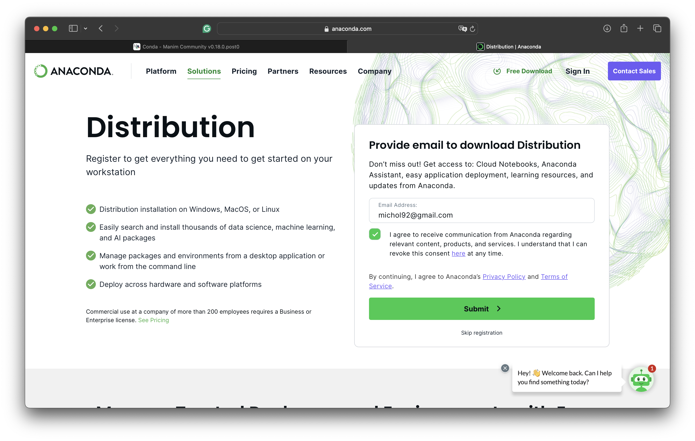
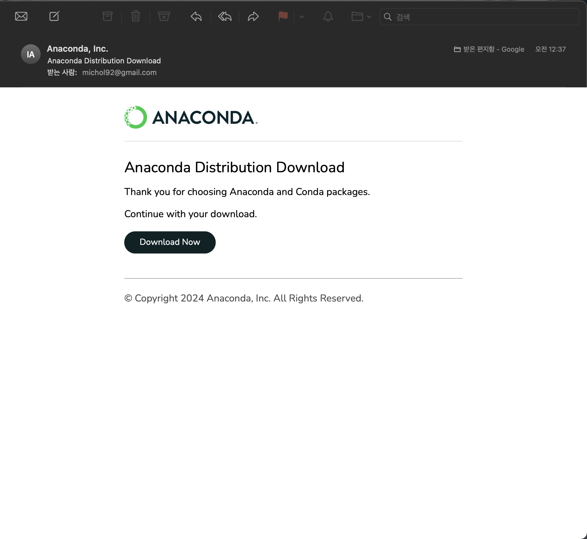
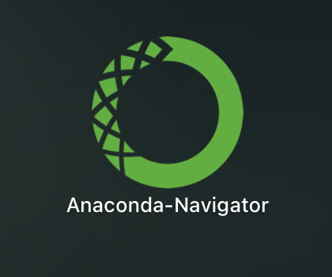

# Manim 설치하기(Mac)

## Anaconda 설치하기

1. [Anaconda 홈페이지](https://www.anaconda.com)에 접속한다
   

2. 오른쪽 위에 있는 Free Download를 누른다
   

3. 이메일을 적고 동의 체크하고 보내기 버튼(Submit)을 누른다
   
   

4. 받은 이메일의 Download Now 버튼 눌러 파일 다운로드 하기
   

5. 설치 후 Anaconda-Navigator가 있는지 확인하면 끝. 
   

    

   

   

## Homebrew 설치하기

1. 먼저 root 권한을 받아온다.

```bash
$sudo -i
```

2./opt 경로에 homebrew 폴더를 생성하고 소유자를 변경한다.

```bash
$cd /opt
$mkdir homebrew
$sudo chown -R $(whoami) /opt/homebrew
```

3.curl 명령어로 homebrew를 받아와서 압축을 해제한다.

```bash
$curl -L https://github.com/Homebrew/brew/tarball/master | tar xz --strip 1 -C homebrew
```

4.환경변수를 추가 및 적용한다.

```bash
$echo 'export PATH="/opt/homebrew/bin:$PATH"' >> ~/.zshrc
$source ~/.zshrc
```

5.[brew.sh](https://brew.sh/)에 있던 명령어를 다시 실행한다.

```bash
$/bin/bash -c "$(curl -fsSL https://raw.githubusercontent.com/Homebrew/install/HEAD/install.sh)"
```

6.잘 설치되었는지 brew 버전을 확인한다.

```bash
$brew --version
```

---

마님 설치는 여러 OS 시스템에 설치가 가능하다. 기본적으로 conda에서 설치하는 방법도 있다. 기초적인 conda 명령어에 대하여 살펴보자.

## conda 명령어

자주사용 하는 Conda 명령어

아래 conda 명령어들은 자주 사용되니 암기(?) 하도록 아니 이 책을 보고 찾아서 실행하자.

① 가상환경 리스트 조회

```bash
conda env list
```

② 가상환경 생성  
conda create -n 가상환경이름

```bash
conda create –n testname
```

특정 버전의 파이썬을 사용하고 싶을 때는 다음과 같이 명령어를 실행 한다.
conda create -n 가상환경이름 python=버전

```bash
conda create -n testname python=3.9
```

③ 가상환경 복제

conda create --clone 복제할 가상환경이름 -n 새 가상환경이름

```bash
conda create --clone testname -n testname
```

④ 가상환경 활성화/비활성화

가상환경 활성화

conda activate 가상환경이름

```bash
conda activate testname
```

가상환경이 활성화된 상태에서 가상환경 비활성화

```bash
conda deactivate
```

⑤ 가상환경 삭제

conda env remove -n 가상환경이름

```bash
conda env remove -n testname
```

⑥ 설치된 아나콘다 버전 확인

```bash
conda --version
```

⑦ 설치된 아나콘다 정보 조회

```bash
conda info
```

⑧ 가상환경에 설치된 패키지 리스트 조회

```bash
conda list
```

⑨ 패키지 설치

conda install 패키지이름

```bash
conda install tensorflow
```

⑩ 설치된 패키지 업데이트

conda update 패키지이름

```bash
conda update tensorflow
```

⑪ 설치된 패키지 삭제

conda remove -n 가상환경이름 패키지이름

```bash
conda remove -n test tensorflow
```

## Termianl 명령어

기본적인 Terminal 명령어를 학습하자.

① ls : 현재 경로에 존재하는 파일/폴더 확인

② pwd : 현재 위치한 경로 출력

③ cd <폴더명> : <폴더명>의 폴더로 이동

④ cd.. : 현재 위치한 경로에서 하위 폴더로 이동

⑤ mkdir : 폴더 생성하기 (원래는 디렉토리 생성의 의미임.)

⑥ rm <파일명> : <파일명>의 파일을 삭제

⑦ rmdir <폴더명> : <폴더명>의 폴더를 삭제, 폴더 안에 파일이 하나도 없어야 한다.

⑧ rm –r <폴더명> : 파일이 존재하는 <폴더명>의 폴더를 삭제

⑨ cp <폴더명 1> <폴더명 2> : <폴더명 1>의 <폴더명 2>로 복제, 폴더 뿐 아니라 파일도 가능.

이 이외의 명령어는 man이라고 치면 명령어 도움을 받을 수 있다.

## Homebrew 명령어

①brew update : brew를 최신버전으로 업데이트

②brew search <패키지명> : 프로그램이 있는지 검색

③brew install <패키지명>[@버전] : 프로그램 설치(최신버전으로)

```bash
brew install python
```

④brew list : 깔려있는 패키지 확인

⑤ brew info <패키지명> : 패키지 정보보기

⑥ brew outdated : 업그레이드 필요한 프로그램 찾기

⑦ brew upgrade <패키지명>: 패키지 업그레이드

⑧ brew upgrade : 모드 패키지 업그레이드

⑨ brew cleanup <패키지명> : 버전을 여러 개 설치를 하였는데 최신버전 이외의 버전들 전부 삭제

⑩ brew uninstall <패키지명> : 특정 패키지 삭제

⑪ Homebrew 삭제하기

아래 명령어를 터미널 창에 붙여넣기를 하고 실행시킨다.

```bash
ruby -e "$(curl -fsSL https://raw.githubusercontent.com/Homebrew/install/master/uninstall)"
```

---

## 패키지 설치하기

1.필요한 종속 패키지를 설치한다.

```bash
brew install py3cairo ffmpeg
```

2.Apple silicon 기반 Mac은 아래 패키지들이 더 필요하다.

```bash
brew install pango pkg-config scipy
```

3.다음으로 manim을 설치한다.

```bash
pip3 install manim
```

4.Tex을 이용한 수식을 나타내기 위해서는 mactex을 설치한다.

```bash
brew install --cask mactex-no-gui
```

## 텍에서 한글을 사용하기 위한 설정

수정해야 할 파일 경로는 아래와 같다. python 버전에 따라 중간에 폴더명이 다를 수 있다.

/opt/anaconda3/lib/python3.11/site-packages/manim/utils/tex.py

즉, ~/site-packages/manim/utils/ 폴더 안에 tex.py를 수정하여야 한다. 아래와 같은 부분을 찾는다.

```bash
default_preamble = r"""
\usepackage[english]{babel}
\usepackage{amsmath}
\usepackage{amssymb}
"""
```

아래 쪽에 \usepackage{kotex}을 입력하고 저장한다.

```bash
default_preamble = r"""
\usepackage[english]{babel}
\usepackage{amsmath}
\usepackage{amssymb}
\usepackage{kotex}
"""
```

## 참고

사용 사례에 따라 다른 설치 옵션이 권장된다.
Manim으로 코딩을 하고 싶다면, 대화형 브라우저 내 노트북은 로컬 설치가 필요하지 않기 때문에 라이브러리를 분석하는 가장 간단한 방법이다. [매님 커뮤니티](https://try.manim.community)로 가서 대화형 튜토리얼을 참고하세요.

그렇지 않으면, 애니메이션 프로젝트에서 작업하기 위해 Manim을 사용하려는 경우, 콘다(conda) 환경, 시스템의 파이썬 또는 도커(Docker)를 통해서 라이브러리를 로컬로 설치하는 것이 좋다.
