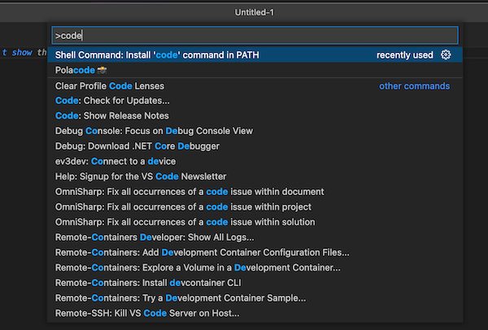

# Visual Studio Code 설치 가이드

## Visual Studio Code 소개와 특징

Visual Studio Code는 Microsoft에서 개발한 무료 오픈소스 코드 편집기입니다. 다양한 플랫폼에서 지원되며, 코드 편집을 비롯한 다양한 개발 작업을 보다 쉽게 수행할 수 있는 기능들을 제공합니다. Visual Studio Code의 주요 특징은 다음과 같다.

- 높은 확장성과 개인화 가능성
- 다양한 프로그래밍 언어 지원
- 코드 작성 및 디버깅 기능
- `Git`과 같은 버전 관리 시스템 연동 기능
- 강력한 `IntelliSense` 기능

## 설치 방법

### Windows에서 설치하기

Visual Studio Code를 [다운로드](https://code.visualstudio.com/download)를 한다.
다운로드한 설치 파일을 실행한다. 설치 파일이 압축 해제되고, 설치 프로그램이 실행된다.
설치할 경로를 선택하고, `Next` 버튼을 클릭한다. 추가 옵션을 선택하고, `Next` 버튼을 클릭한다. `Install` 버튼을 클릭하여 설치를 진행한다. 설치가 완료되면 `Finish` 버튼을 클릭한다.

### macOS에서 설치하기

Visual Studio Code를 [다운로드](https://code.visualstudio.com/download)를 한다.
다운로드한 설치 파일을 실행한다.
설치 파일이 압축 해제되고, 설치 프로그램이 실행된다.
`Visual Studio Code`를 `Applications` 폴더에 설치하도록 설정한다.
`Continue` 버튼을 클릭한다.
`Install` 버튼을 클릭하여 설치를 진행한다.
설치가 완료되면 `Close` 버튼을 클릭한다.

## 파이썬 사용 시 기본 설정

### Python Extension

파이썬 Extension 추가를 해야한다. VScode에서 파이썬을 사용하기 위해서 Python Extension을 설치해준다.

### Python Interpreter

Interpreter 선택
Extension 설치가 끝났다면, 어떤 파이썬의 Interpreter 환경을 통해 코드를 실행할지 선택한다.
화면 오른쪽 하단에 인터프리터를 선택할 수 있는 칸이 있다.

## 특징 및 주요 기능

### 높은 확장성과 개인화 가능성

Visual Studio Code는 많은 플러그인과 확장성을 가지고 있다. 사용자가 원하는 기능을 추가하거나 제거할 수 있으며, 자신만의 개인화된 환경을 만들 수 있다.

### 다양한 프로그래밍 언어 지원

Visual Studio Code는 다양한 프로그래밍 언어를 지원한다. JavaScript, HTML, CSS, Python, Java, C#, PHP, Ruby 등 다양한 언어의 코드를 작성할 수 있다.

### 코드 작성 및 디버깅 기능

Visual Studio Code는 코드 작성을 위한 다양한 기능을 제공합니다. IntelliSense를 통해 자동 완성 기능을 제공하며, 코드 스니펫, Emmet, 터미널 등 다양한 기능을 지원한다. 또한, 디버깅 기능을 통해 코드의 문제를 더 쉽게 해결할 수 있다.

### Git과 같은 버전 관리 시스템 연동 기능

Visual Studio Code는 Git과 같은 버전 관리 시스템과 연동할 수 있는 기능을 제공한다. Git의 브랜치, 커밋, 푸시 등의 작업을 Visual Studio Code에서 수행할 수 있다.

### 강력한 IntelliSense 기능

Visual Studio Code는 강력한 IntelliSense 기능을 제공한다. IntelliSense를 통해 코드 작성 시 자동 완성 기능을 제공하며, 코드에서 오류를 식별하고 해결하는 데 도움을 준다.

## Vscode를 터미널에서 실행

Vscode를 터미널에서 실행시키기 위해서는 Vscode에서 절정을 따로 해주어야 한다. cmd + shift + p (⌘ + ⇧ + p)눌러서 command palette 창을 열자. 다음과 같은 명령어를 일부만 입력하면 전체 명령어를 선택하여 설치하자. 좋은 점은 터미널에서 실행하면 Vscode 설정이 자동으로 PATH가 이어져서 따로 PATH를 설정하지 않아도 된다.

```bash
shell command : instlal 'code' command in PATH
```



실행을 할 때는 원하는 폴더로 들어가서 아래와 같이 입력을 하면 된다.

```bash
code .
```
