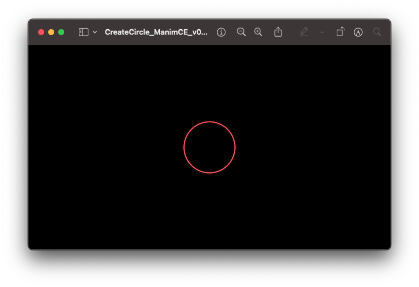
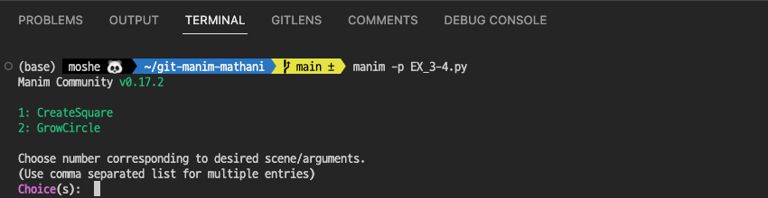
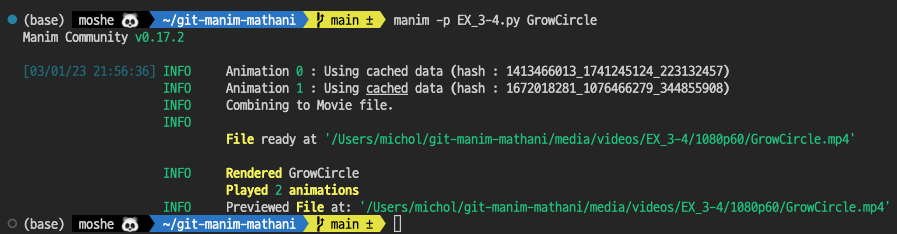
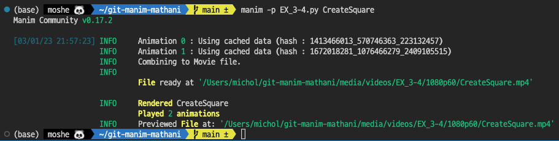
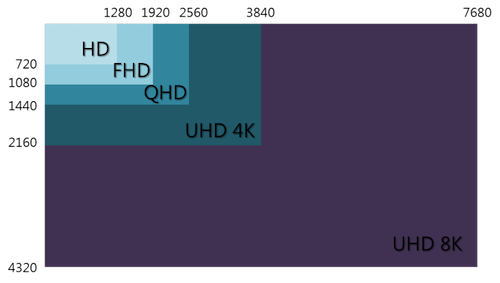
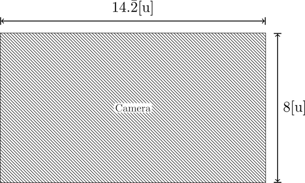
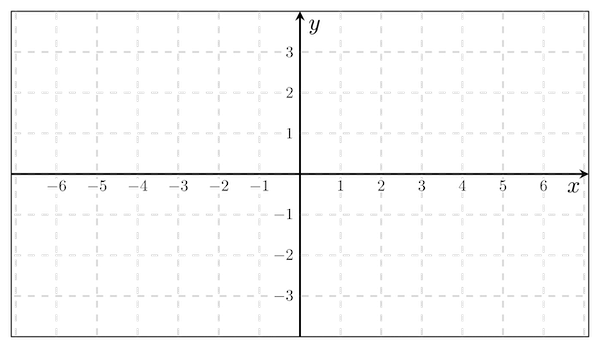
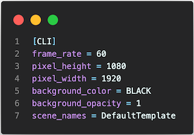

# Manim Scene 렌더링

## 'Hello World'인 원 나타내기

Manim을 처음으로 실행하자. 코딩을 처음으로 하는 'Hello World'를 화면에 나타나게 하는 것이다. Manim에서는 '원을 나타내기'가 이에 해당한다.

클래스와 메소드의 개념이 필요는 하지만 우선 실행을 하여 보도록 하자. 첫 번째 매개 변수로 클래스의 인스턴스가 넘어오게 된다. 이 첫 번째 매개 변수의 이름은 보통 관행적으로 `self`라고 하며, 인스턴스 메서드는 이 `self`를 통해 인스턴 스 속성(attribute)에 접근하거나 다른 인스턴스 메서드를 호출할 수 있다. 뿐만 아니라 `self`를 통해, 클래스 속성에 접근하거나 클래스 메서드를 호출할 수도 있다.
우선 원 하난를 그려보려고 한다.

```python
from manim import *
```

manim 모듈에서 전부(\*)를 가져왔다. 물론 `import manim`과 같다. 그러나 이렇게 하면 좀더 편리하다.

`CreateCircle`란 이름의 클래스를 정의하고 `Scene`에 상속한다.

```python
class CreateCircle(Scene):
```

클래스 CreateCircle 안에 메소드 construct를 def 키워드를 사용하여 정의한 다. 파이썬은 클래스의 메소드를 정의할 때 self를 명시한다. 메소드를 불러올 때 self는 자동으로 전달된다. self를 사용함으로 클래스 안에 정의한 멤버에 접근할 수있게된다.또한파이썬에서는중괄호{ }을사용하여메소드를묶지않고 들여쓰기를 하여 이를 구분한다. 코드 블럭을 구성하기 위해 if, for, class, def 등등을 작성하면서 나오는 : 다음 아랫줄은 반드시 들여쓰기를 해야 한다. 들여 쓰기의 방법은 스페이스바로 네 칸 또는 한 번의 탭 방식을 사용한다. 중요한 것은 같은 블록 내에서는 들여쓰기 칸 수가 같아야 한다는 것이다. 위반시에는
"IndentationError: unexpected indent"라는 에러 메세지가 출력된다.

```python
    def construct(self):
```

이제 manim 모듈에서 불러온 Circle() 메서드를 이용하여 원을 그리자. 아래와 같이 두 탭 들여쓰기를 하여 작성하자.

```python
        self.add(Circle())
```

Circle()의 () 안에 아무것도 코딩을 하지 않으면 기본값인 중심이 원점이고 반지름 1이며 테두리 색이 빨간색인 원을 그린다. 나중에 매개변수, 메소드, 속성 등에 대하여 논의하자. 지금은 그냥 넘어가자.

전체 코딩은 다음과 같다.

```python linenums="1"
from manim import *

class CreateCircle(Scene):
    def construct(self):
        self.add(Circle())
```

파일명을 `EX_3-1.py`라 저장하자. 파일명은 아래도 좋다.

터미널 창에서 아래와 같이 코딩후 엔터를 치면 렌더링이 된다.

```bash
~ manim -p EX_3-1.py
```

렌더링 방법과 옵션은 아래에 있는 문서를 참조하시오.

그러면 아래와 같이 실행이 된다. 플래그(flag) `-p`는 렌더링후 실행시키라는 옵션이다.


그러면 아래와 같이 실행된다. 동영상이 아니다. 그림이다. `self.add()`는 오브젝트만을 단지 추가할 뿐이다. 실행 파일도 그림을 볼 수 있는 맥의 경우 `미리보기`가 실행된다.

코딩 중에 `self.add(Circle())`처럼 코딩을 할 수도 있으나 인스턴스를 사용하여 코딩을 한다. 그래야 여러 개의 객체를 사용할 수 있다. 아래와 같이 코딩을 하고 파일명을 EX_3-2.py로 하자.

```python linenums="1"
from manim import *

class CreateCircle(Scene):
    def construct(self):
        cir = Circle() // cir이 인스턴스이다.
        self.add(cir)
```

결과는 EX_3-1.py를 실행한 것과 같이 그림 프로그램이 실행되고 아래와 같다.


## 원을 커지면서 나타나는 애니메이션 실행하기

애니메이션을 구현하려면 오브젝트를 `self.play()`로 실행을 시켜야 한다. 오브젝트 중심으로 부터 커지면서 나타나는 애니메이션 모듈은 `GrowFromCenter([오브젝트 이름])`을 사용하여야 한다. 아래와 같이 코딩을 하고 EX_3-3.py로 저장을 하자.

```python linenums="1"
from manim import *

class CreateCircle(Scene):
    def construct(self):
        cir = Circle() // cir이 인스턴스이다.
        self.play(GrowFromCenter(cir))
```

Circle() 안에 attributes들을 정의 하지 않으면 기본값이 원점을 중심으로 하고 반지름이 1인 원을 출력한다.
렌더링을 실행하자. 그러면 아래와 같이 실행 된다.


## 두 개의 scene 렌더링 하기

이 번에는 한 파일에 여러 Scene를 렌더링 하는 것에 대하여 알아보자.

두 개의 Scene으로 나누어서 렌더링을 하려고 한다.

첫 번째 Scene은 원이 중심이 원점이고 반지름이 1인 원이 커지면서 나타나게 하고, 두 번째 Scene은 이 정사각형이 그려지면서 만들어지게 하려고 한다.

```python linenums="1" hl_lines="3 9"
from manim import *

class GrowCircle(Scene):
    def construct(self):
        cir = Circle()
        self.play(GrowFromCenter(cir))
        self.wait(1)

class CreateSquare(Scene):
    def construct(self):
        squ = Square()
        self.play(Create(squ))

```

EX_3-4.py 파일 내에 여러 개의 Scene이 있으면 다음과 같은 여러 개의 렌더링 방법으로 실행하여야 한다.

우선 첫 번째 렌더링이다.

```bash
manim -p EX_3-4.py
```



그러면 두 개의 Scene의 Scene의 이름이 보인다. 1. CreateSquare 2. GrowCircle을 선택하면 선택한 Scene이 렌더링 된다.  
또한 강제로 GrowCircle Scene을 렌더링하려면 아래와 같이 실행하면 된다.

```bash
manim -p EX_3-4.py GrowCircle
```



강제로 CreateSquare Scene을 렌더링하려면 아래와 같이 실행하면 된다.

```bash
manim -p EX_3-4.py CreateSquare
```



그러나 모든 Scene를 렌더링 하려면 다음과 플래그 -a를 넣어 실행하면 된다.

```bash
manim -p -a EX_3-4.py
```


실행은 두 개가 각각 렌더링 실행이 아래와 같이 실행이 된다.


## 렌더링시 주요 플래그(flag) 옵션

### 옵션

기본적인 영상 비율은 16:9이다.

|      flag       | 함수(function)                                                                    |
| :-------------: | --------------------------------------------------------------------------------- |
|       -p        | 렌더링후 결과(이미지, 영상)를 실행한다.                                           |
|       -ql       | 크기가 720px $\times$ 480px이고 15프레임인 영상으로 렌더링한다.                   |
|       -qm       | 크기가 1280px $\times$ 720px이고 30프레임인 영상으로 렌더링한다.                  |
|       -qh       | 크기가 1920px $\times$ 1080px이고 60프레임인 영상으로 렌더링한다.                 |
|       -qk       | 크기가 3840px $\times$ 2160px이고 120프레임인 4k 영상으로 렌더링 한다.            |
| --save_sections | 영상을 섹션별로 저장한다.                                                         |
|       -a        | 모든 scene을 렌더링한다.                                                          |
|       -i        | gif 파일로 출력한다.                                                              |
|       -f        | 렌더링을 하고 렌더링한 위치에서 파일 브라우저(Finder(맥), 탐색기(윈도우))를 연다. |

각 해상도에 따르는 크기 비교는 아래와 같다.  


| 해상도  |                    | 가로×세로 | 화소수 | 비율 |
| ------- | ------------------ | --------- | ------ | ---- |
| SD      | Standard Definiton | 720×480   | 30만   | 4:3  |
| HD      | Hight Definiton    | 1280×720  | 100만  | 16:9 |
| FHD     | Full HD            | 1920×1080 | 200만  | 16:9 |
| UHD(4k) | Ultra HD(4k)       | 3840×2160 | 800만  | 16:9 |

16:9 비율의 가로 세로 비

| 가로 | 세로 | 표준    |
| ---- | ---- | ------- |
| 800  | 450  |         |
| 960  | 450  | qHD     |
| 1280 | 720  | HD      |
| 1920 | 1080 | Full HD |
| 3840 | 2160 | UHD     |

### Manim 영상 출력 영역과 좌표

매님(Manim)의 영상이 출력되는 범위가 있다. 크기는 14.2[u]×8[u]인데 이것은 16:9의 비율이다.


좌표평면의 좌표로는 x좌표는 -7~7, y좌표는 -4~4까지의 영역에서 출력한다.


### Manim 렌더링 형식

```bash
manim [OPTIONS] FILE [SCENES]
```

크기가 1920px $\times$ 1080px이고 60프레임인 영상으로 렌더링은 아래와 같이 입력하고 실행한다.

```bash
manim -qh FileName.py Scene
```

### 초기 설정하기

매님도 초기 설정을 하여 영상 제작시 기본설정으로 영상을 만들 수 있다.

유튜브(YouTube)에서 기본 영상 사이즈가 16:9이다. 작업을 할 폴더 안에 manim.cfg를 [그림 1]과 같이 작성하자. 가로:세로의 비가 1920:1080으로 이 비는 16:9와 같다. 그러면 터미널 창에서 렌더링을 하면 아래의 기본 조건으로 렌더링을 하게 된다.



플래그 옵션의 상세한 내용을 확인하려면 터미널 창에 다음과 같이 입력한다.

```bash
manim cfg --help
```

초기 설정을 하고 나면 아래와 같이 입력하고 실행한다.

```bash
manim -p FileName.py SceneName
```
