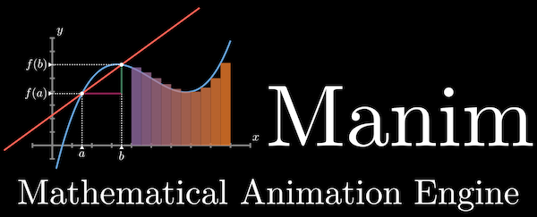
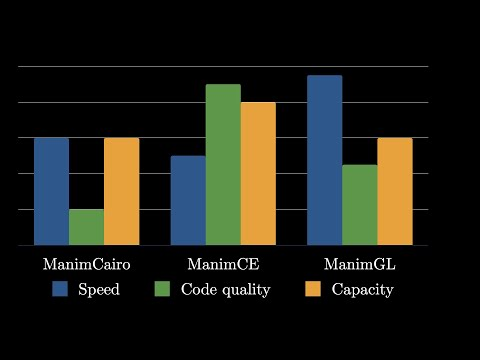

# 1장 Manim이란?

`Manim`은 수학・과학에서 그래프, 수식, 도형 등에 대하여 애니메이션을 구현하는 동영상 제작툴이다. 구독자수가 499만명(2023년 2월 28일 기준)인 YouTube 채널 [3Blue1Brown](<[http:](https://www.youtube.com/channel/UCYO_jab_esuFRV4b17AJtAw)>)에서 `Manim`으로 수학・과학과 관련된 애니메시션을 제작하고 제작된 영상을 서비스하고 있다. 3Blue1Brown의 기본 영상 제작 기분은 논리적이지만 직관과 시각화를 통해서 이를 증명 또는 설명을 한다는 철학을 가지고 있다. 보통 알려진 증명과 논리 위주의 엄격한 수학과는 달리 수학의 본질을 바라보려고 하는 것이 특징이다. 그래서 채널의 방향성도 수학을 최대한 직관으로써 설명하는 데에 둔다. 많은 영상에서 그랜트 자신이 강조하는 점 중 하나가 "명제의 참과 거짓을 해결하는 데에 매달려 있는 것보단 실질적인 문제들을 해결하는 데에 초점을 두어야 한다."라는 것이다.  
3Blue1Brown 채널은 시리즈로는 다섯 개가 운영되고 있다.

- 선형대수학의 본질 (시즌 1, Essence of Linear Algebra) 공식 번역
- 미적분학의 본질 (시즌 2, Essence of Calculus) 공식 번역
- 신경망 (시즌 3, Neural Networks)
- 미분방정식 (시즌 4, Differential Equations)
- 자가격리자를 위한 수학 (시즌 5, Lockdown Math)

기하학, 원주율, 여러가지 수학과학에 대한 해설 등으로 구성되어 있고 흥미로운 영상들을 서비스 하고 있다.

`Manim`은 유튜버 3Blue1Brown 팀의 스테포드 대학교에서 수학을 전공한 Grant Sanderson이 제작한 수학 애니메이션용 파이썬 패키지이로 'Mathematical Animation Engine'의 약자이다. 3Blue1Brown 팀의 영상 제작에 사용되며 2021년 2월에 공개되었다. FFmpeg와 OpenGL, LaTeX이 설치가 되어 있어야 manim을 구동할 수 있다.좀 더 개발을하기 하기 위해서는 sox가 필요하다.  
 또한 manim을 기반으로 여러가지 플러그인을 설치할 수 있다. 주요 플러그인은 [manin-physics](https://github.com/Matheart/manim-physics), [manin-voiceover](https://voiceover.manim.community/en/stable/), [manim-slider](https://github.com/jeertmans/manim-slides) 등이 있다.

2023년 2월 기준, Manim 과 ManimGL, ManimCairo 세 가지 버전이 있다.[1].  
① Manim: PyPI 패키지에서 manim으로 등록되어 있음. 코드 내에서도 manim이라 작성하여 사용한다. 2020년 일부 개발자들이 오픈소스 커뮤니티의 이점을 가지고 발전시키기 위해 ManimCairo 커뮤니티를 복제하여해서 만든 커뮤니티 버전이다. Reference Manual 과 예제 소개 등의 문서화가 잘 되어있고, JupyterLab 을 이용하면 렌더링 결과를 바로 볼 수도 있다. 커뮤니티 기반임을 강조하기 위해 manimCE 라고도 부른다. 지금 현재(2023년 2월 28일) 최신 버전 0.17.2이다.  
② ManimGL: PyPI 패키지에서 manimgl로 등록되어 있음. 파이썬 코드 내에선 manimlib라 작성하고 사용한다. 원 저작자 Grant Sanderson가 직접 관리하고 3Blue1Brown 애니메이션 작성할 때 이용하는 패키지이다. 하지만 스스로 사용하기 위해 만드는 것이기 때문에 공식 저장소에서는 이용자가 하위호환성, 문서화, 테스트, 커뮤니티 소통 등을 원한다면 커뮤니티 버전을 이용할 것을 README에서부터 권하고 있다.[2] Grant가 공개하고 있는 3Blue1Brown 유튜브 애니메이션에 쓰인 소스코드를 가지고 비디오를 다시 렌더링하고자 한다면 이 버전을 이용하면 된다.  
 
③ ManimCairo: ManimGL의 예전 버전을 지칭하기 위한 이름이다. ManimGL 저장소의 cairo-backend 브랜치에서 찾아볼 수 있으며, 2019~2021년 Grant 가 더 빠른 OpenGL 렌더링을 위해 shaders 브랜치에서 작업했고, 이후 master(ManimCairo) 브랜치와 병합하며 ManimGL 브랜치를 만들었다. Grant의 옛날 애니메이션을 렌더링할 때 필요할 수 있다.

## manim vs manimgl vs manimcario 비교

<!---->

## Manim 참고 메뉴얼 및 github

### 메뉴얼

- [Manim 패키지 커뮤니티 매뉴얼](https://docs.manim.community/en/stable/index.html)
- [ManimGL 패키지 공식 매뉴얼](https://3b1b.github.io/manim/getting_started/installation.html)

### github

- [manim](https://github.com/ManimCommunity/manim)
- [manimgl(또는 3b1b)](https://github.com/3b1b/manim)
- [manimcario](https://github.com/3b1b/manim/tree/cairo-backend)

---

## 참고문헌

[1] Why are there different versions of Manim?  
[2] 실제로 2023년 2월 현재 ManimGL의 설치방법 및 일부 애니메이션 예제코드들은 문서화되어 있지만 코드 작성에 필요한 클래스, 메소드, 인자 등이 자세히 기술된 Reference Manual 가 없어 이용이 어렵다.  
[3] [나무위키](https://namu.wiki/w/manim#fn-1)
