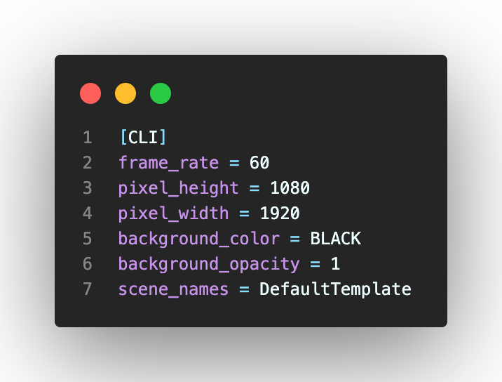

# 렌더링시 주요 플래그(flag) 옵션

기본적인 영상 비율은 16:9이다.

|      flag       | 함수(function)                                                                    |
| :-------------: | --------------------------------------------------------------------------------- |
|       -p        | 렌더링후 결과(이미지, 영상)를 실행한다.                                           |
|       -ql       | 크기가 854px $\times$ 480px이고 15프레임인 영상으로 렌더링한다.                   |
|       -qm       | 크기가 1280px $\times$ 720px이고 30프레임인 영상으로 렌더링한다.                  |
|       -qh       | 크기가 1920px $\times$ 1080px이고 60프레임인 영상으로 렌더링한다.                 |
|       -qk       | 크기가 3840px $\times$ 2160px이고 120프레임인 4k 영상으로 렌더링 한다.            |
| --save_sections | 영상을 섹션별로 저장한다.                                                         |
|       -a        | 모든 scene을 렌더링한다.                                                          |
|       -i        | gif 파일로 출력한다.                                                              |
|       -f        | 렌더링을 하고 렌더링한 위치에서 파일 브라우저(Finder(맥), 탐색기(윈도우))를 연다. |

플래그 옵션의 상세한 내용을 확인하려면 터미널 창에 다음과 같이 입력한다.

```bash
manim cfg --help
```

# 초기 설정하기

매님도 초기 설정을 하여 영상 제작시 기본설정으로 영상을 만들 수 있다.

유튜브(YouTube)에서 기본 영상 사이즈가 16:9이다. 작업을 할 폴더 안에 manim.cfg를 [그림 1]과 같이 작성하자. 가로:세로의 비가 1920:1080으로 이 비는 16:9와 같다. 그러면 터미널 창에서 렌더링을 하면 아래의 기본 조건으로 렌더링을 하게 된다.


