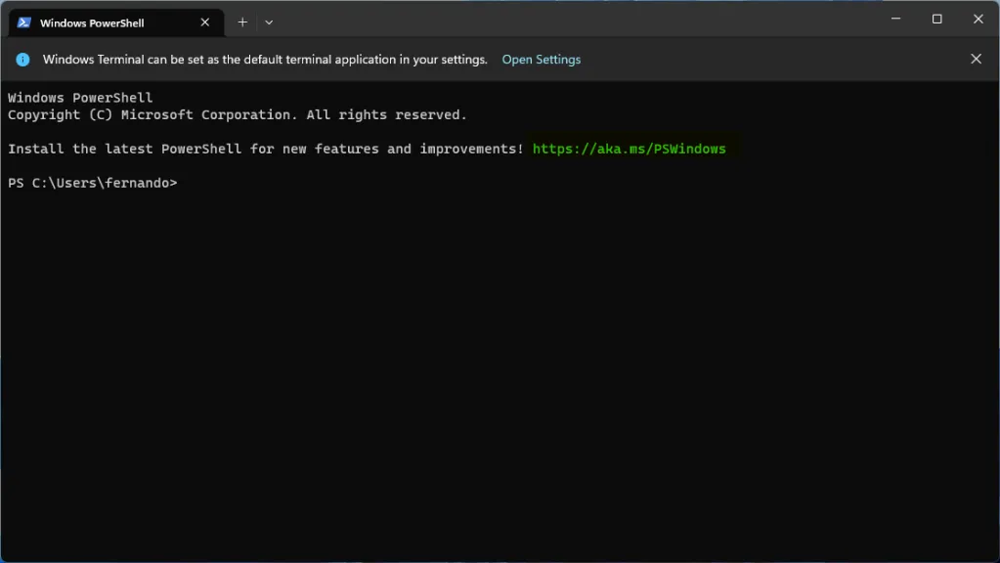

# Manim 설치하기(Windows)

## scoop를 이용하여 설치하기

사양은 `윈도우 11`을 기준으로 설명 하겠다.

1. 원도우 파워쉘(powershell) 실행.

   
   .

2. scoop 설치

   Scoop(스쿱)은 윈도우의 패키지 매니저이다. 패키지 매니저는 쉽게 말하면 인스톨러(installer - 설치기)라고 할 수 있다. 유닉스에서 보면 터미널 창에서 프로그램 및 라이브러리 등을 설치하는 것을 볼수 있는데 윈도우에서도 이와 같이 할 수 있게 해주는 것이다.  
    아래 두 줄의 명령어를 실행 시키자.

   ```bash
   Set-ExecutionPolicy -ExecutionPolicy RemoteSigned -Scope CurrentUser
   Invoke-RestMethod -Uri https://get.scoop.sh | Invoke-Expression
   ```

   scoop에 대한 더 자세한 것은 [스켑 홈페이지](https://scoop.sh)를 참조하여라.

3. 파이썬과 ffmpeg 설치

   ```bash
   scoop install python ffmpeg
   ```

4. latex 설치

   ```bash
   scoop install latex
   ```

5. manim 설치

   ```bash
   python -m pip install manim
   ```

6. vscode 설치

   ```bash
   scoop bucket add extras
   scoop install vscode
   ```

scoop를 사용하여 manim을 설치하는 것이 매우 무난해 보인다.
Chocolatey와 winget도 아래와 같은 순서대로 설치를 하면 된다.

## Chocolatey를 사용하여 설치

1. Window Powershell 관리자 권환으로 실행
2. Get-ExecutionPolicy 실행
   Restricted가 아닐 경우 Set-ExecutionPolicy AllSigned 실행 후 Y 입력
3. 다음 코드 입력

   ```bash
   Set-ExecutionPolicy Bypass -Scope Process -Force; [System.Net.ServicePointManager]::SecurityProtocol = [System.Net.ServicePointManager]::SecurityProtocol -bor 3072; iex ((New-Object System.Net.WebClient).DownloadString('https://community.chocolatey.org/install.ps1'))
   ```

4. 설치 확인
   choco를 입력해 버전이 나온다면 설치 완료가 되었다.
5. Manim 설치

   ```bash
   choco install python --pre
   choco install manim-latex
   choco install manimce
   ```

manim-latex 대신 miktex으로 설치를 하여도 된다.

```bash
choco install miktex
```

## Winget을 사용하여 설치

winget 커맨드라인 명령어를 사용하기 위해서는 ’앱 설치 관리자 패키지’가 아닌 Preview(미리보기) 버전을 설치해야한다. 또한 미리보기 버전을 설치하기 위해서는 먼저 패키지 매니저 인사이더 프로그램이나 윈도우 인사이더 프로그램에 가입해야한다.

1. winget 미리 보기 버전 설치 [개발자 전용]

   WinGet은 [Windows 앱 설치 관리자](https://www.microsoft.com/p/app-installer/9nblggh4nns1#activetab=pivot:overviewtab)에 포함되어 있다.

- 최신 [winget 미리 보기 버전](https://aka.ms/getwingetpreview)을 다운로드한다. 새로운 기능에 대해 알아보려면 [winget 미리 보기 릴리스 정보](https://github.com/microsoft/winget-cli/releases)를 참조하여라. 이 패키지를 설치하면 WinGet 클라이언트의 미리 보기 버전이 제공되지만 Microsoft Store에서 새 미리 보기 버전의 자동 업데이트가 사용하도록 설정되지는 않는다.
- MSA(Microsoft 계정), 회사, 학교 또는 AAD(Azure Active Directory) 계정을 사용하여 [Windows 참가자 개발자 채널](https://insider.windows.com/understand-flighting)에 등록한다. Windows 참가자 개발자 채널에는 Microsoft Store의 새로운 미리 보기 버전에 대한 자동 업데이트가 포함되어 있다.
- MSA(Microsoft 계정)를 사용하여 Windows 패키지 관리자 참가자 프로그램에 등록한다. MSA(Microsoft 계정)가 추가되면(이메일 알림을 받은 지 며칠 후) Microsoft Store에서 새 미리 보기 버전의 자동 업데이트를 할 수 있다.

1. 다음로 파이썬, ffmpeg, miktex과 manim 순으로 설치를 하면 된다.

   ```bash
   winget install python
   winget install ffmpeg
   winget install --id=MiKTeX.MiKTeX  -e
   python -m pip install manim
   ```
