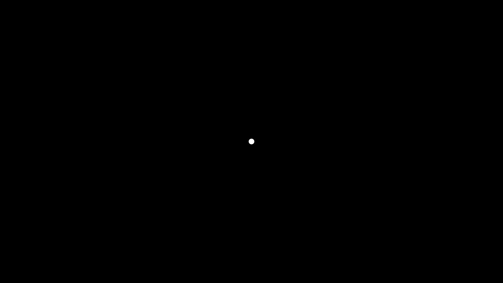
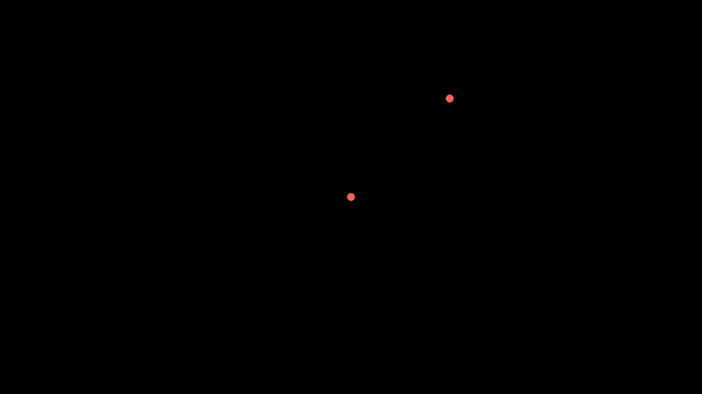

# Manim 코딩 기초

이전까지 매님의 기초적인 코딩과 랜더링을 살펴보았다. 이제 본격적으로 매님의 코딩 문법을 배우도록 하자.
많은 명령어가 있지만 중요하게 사용되는 명령어를 기준으로 살펴보자.

## 점

매님에서의 '점(point)'에 대한 클래스는 'Dot' 클래스이다.

제한적인 이름: manim.mobject.geometry.arc.Dot

```python
class Dot(point=array([0., 0., 0.]), radius=0.08, stroke_width=0, fill_opacity=1.0, color=ManimColor('#FFFFFF'), \*\*kwargs)
```

Bases: Circle

파라미터:

| point (Point3D)            | 점(Dot) 위치, 3차원 numpy 배열, 기본값:ORIGIN         |
| -------------------------- | ----------------------------------------------------- |
| radius (float)             | 점 반지름, 기본값은 DEFAULT_DOT_RADIUS(0.08)          |
| stroke_width (float)       | 점의 둘레의 선 두께, 기본값은 0                       |
| fill_opacity (float)       | 점의 채워진 색의 투명도 값은 0~1을 갖는다. 기본값은 1 |
| color (ParsableManimColor) | 점의 기본색인 흰색                                    |

메쏘드(Method):

| animate             | self 메쏘드에 어떤 응용 애니메이션을 적용할 때 사용 |
| ------------------- | --------------------------------------------------- |
| animation_overrides |                                                     |
| color               |                                                     |
| depth               | mobject의 깊이                                      |
| fill_color          | 하나의 점에 채우기 색을 설정할 때 사용              |
| height              | mobject의 높이                                      |
| n_points_per_curve  |                                                     |
| sheen_factor        |                                                     |
| stroke_color        | 점의 선 색                                          |
| width               | mobject의 너비                                      |

아래와 같이 입력을 하여 보자.

```python
dot_O= Dot()
```

원점을 dot_O라는 이름으로 정의된것이고 가운데에 흰색 점이 보일 것이다. 아무것도 입력을 하지 않으면 위치는 초기값으로 원점 즉, [0,0,0]에 찍힌다. Dot의 위치는 [a,b.c]는 3차원 좌표 점을 입력해야 한다. 평면의 점에 나타내는 경우가 많으므로 z 좌표값을 0을 입력하면 된다. 즉, [1,2,0]으로 나타내면 2차원 좌표 점 (1,2)에 점이 찍힌다.

기본적으로 점의 색은 '흰색'이다. 이를 바꾸려면 다음과 같이 코딩을 한다.

```python
dot_A=Dot(color=RED)
```

🌀 **예제 1**

```python linenums="1"
from manim import *

class Point(Scene):
    def construct(self):
        dot_A=Dot()
        self.add(dot_A)
```

> [!NOTE] 
>
> **예제 1 실행결과** 
> 

Dot 클래스 color 파라미터에 색을 지정하면 된다. 색은 자주사용되는 색 이름(RED, BLUE, GREEN 등등)을 사용거나 RGB Hex Code 값(#000000 부터 #FFFFFF까지)으로도 입력이 가능하다. 매님에서는 Color 클래스에서 색 이름을 확인할 수 있다. 아래 코드에서는 `color=RED`와 `color=#FC6255`는 같은 빨간색 점이 나타난다. 점 A는 원점, 점 B는 [2,2,0]에 빨간색 점으로 나타난다.

🌀 **예제 2**

```python linenums="1"
from manim import *

class Point(Scene):
    def construct(self):
        dot_A=Dot([0,0,0], color=RED)
        dot_B=Dot([2,2,0], color='#FC6255')
        self.add(dot_A, dot_B)
```

> [!NOTE] 
>
> **예제 2 실행결과** 
> 

지정한 색을 다른 색으로 바꾸고 싶을 때는 set_color 매소드를 사용하면 된다.

```python
dot_A=Dot().set_color(BLUE)
```

아래 코드는 점 A를 원점에서 흰색으로 나타내고 3초 후에 파란색으로 바꾸는 코딩이다. 우선 A 점을 self.add() 명령어로 나타내고, 2초 후에 animate()로 색깔이 바뀌는 애니메이션을 구현한다. 영상의 애니메이션이 마지막까지 구현되도록 마지막에 1~2초의 기다림을 주어야 한다.

🌀 **예제 3**

```python linenums="1"
from manim import *

class Point(Scene):
    def construct(self):
        dot_A=Dot()
        self.add(dot_A)
        self.wait(2)
        self.play(dot_A.animate().set_color(BLUE))
        self.wait(2)
```

> [!NOTE] 
>
> **예제 3 실행결과** 
>
> <video src=".././media/videos/4_2_ex3/1080p60/Point.mp4" width="800" height="450" controls></video>

Dot()은 다음과 같은 초기값으로 출력된다. 반지름이 0.8인 원으로 흰색으로 채워져있고 원점에 위치한 점으로 나타난다.

```python
Dot(point=array([0., 0., 0.]), radius=0.08, stroke_width=0, fill_opacity=1.0, color=ManimColor('#FFFFFF'))
```

## 선분

선분은 Line의 클래스를 사용하여야 한다. Line()은 다음과 같은 초기값으로 출력된다. 두 점 [-1,0,0], [1,0,0]을 잇는 흰색 선분으로 출력된다.

```python
Line(start=array([- 1., 0., 0.]), end=array([1., 0., 0.]), buff=0, path_arc=None)
```

선분을 나타내기 위해서는 우선 두 점 ptA, ptB를 정의하고 Line 명령어로 그리면 된다. get_cetner() 명령어는 점의 중앙에서 선분을 시작하거나 끝나도록 하는 것이다.

```python
ptA = Dot([0,-0,0])
ptB = Dot([3,2,0])
line_AB = Line(ptA.get_center(),ptB.get_center())
```

전체 코딩은 아래와 같다.

```python linenums="1"
from manim import *

class Point_Draw(Scene):
    def construct(self):
        ptA = Dot([0,-0,0])
        ptB = Dot([3,2,0])
        line_AB = Line(ptA.get_center(),ptB.get_center())
        self.add(line_AB)
```

더우기 선에 애니메이션을 넣어 그리게 하가 하려면 Create() 명령어를 사용하여 self.play(Create(lineAB))라고 코딩을 하면된다. run_time=2는 2초 동안 애니메이션을 구동하게 한다.

전체 코딩은 아래와 같다.

```python linenums="1"
from manim import *

class Point_Draw(Scene):
    def construct(self):
        ptA = Dot([0,-0,0])
        ptB = Dot([3,2,0])
        line_AB = Line(ptA.get_center(),ptB.get_center())
        self.play(Create(line_AB), run_time=2)
```

## 선분을 점선으로 나타내기

선분을 점선으로 나타내려면 'DashedLine' 명령어를 사용하여 나타내면 된다.

```python linenums="1"
from manim import *

class Point_Draw(Scene):
    def construct(self):
        ptA = Dot([0,-0,0])
        ptB = Dot([3,2,0])
        line_AB = DashedLine(ptA.get_center(),ptB.get_center())
        self.play(Create(line_AB), run_time=2)
```

DashedLine()의 () 안에 마지막 옵션으로 `dash_length=숫자`를 넣으면 점선 간격 및 점선의 길이를 조절하여 나타낼 수 있다. 아래와 같이 사용하면 된다.

```python
line_AB = DashedLine(ptA.get_center(),ptB.get_center(), dash_length=0.1)
```

```python linenums="1"
from manim import *

class Point_Draw(Scene):
    def construct(self):
        ptA = Dot([0,0,0])
        ptB = Dot([3,2,0])
        line_AB = DashedLine(ptA.get_center(),ptB.get_center(), dash_length=0.1)
        self.play(Create(line_AB), run_time=2)
```

## 원

원은 반지름을 입력값으로 그리고 이를 이동시켜서 표현 한다.

제한적인 이름: manim.mobject.geometry.arc.Circle

class Circle(radius=None, color=ManimColor('#FC6255'), \*\*kwargs)
Bases: Arc

파라미터:
color (ParsableManimColor) – 도형 색
radius (float | None)
